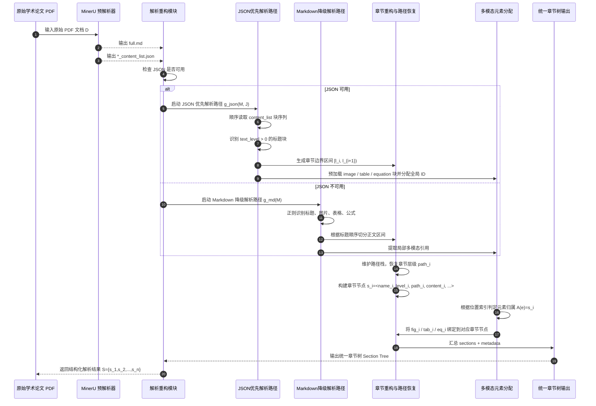
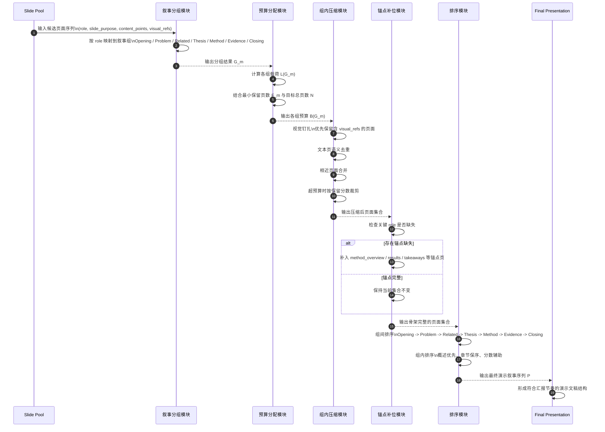

# 基于多Agent的学术论文演示文稿生成技术研究

[TOC]


## 第一章 绪论

### 1.1 研究背景与意义

​	随着人工智能技术的快速发展和学术研究规模的持续扩大，科研成果的高效传播与准确表达正成为学术交流中的关键问题。学术演示文稿（Presentation Slides, PPT）作为学术报告、论文答辩和科研交流中最常用的展示形式之一，在研究成果的传播过程中发挥着不可替代的作用。一份结构清晰、逻辑严谨且视觉表达合理的学术演示文稿，能够有效降低听众的认知负担，提升复杂研究内容的理解效率，从而增强学术交流的质量与影响力。然而，在实际科研工作中，学术演示文稿的制作仍高度依赖人工经验。科研人员通常需要从篇幅冗长、结构复杂的学术论文中筛选关键信息，重新组织叙事逻辑，并将文本、图表与公式等多模态内容进行适配性整合。这一过程不仅耗时耗力，而且高度依赖制作者的主观判断，容易引入信息遗漏、逻辑断裂以及图文表达不一致等问题。尤其是在多模态信息日益丰富的背景下，如何在保证学术严谨性的前提下，实现论文内容向演示文稿的高质量转化，已成为智能内容生成领域亟需解决的重要问题。

​	近年来，自然语言处理（Natural Language Processing, NLP），计算机视觉（Computer Vision, CV）与多模态学习技术的快速进步，为学术文档的自动化处理提供了新的技术基础。特别是以大语言模型（Large Language Model, LLM）为代表的新一代生成模型，在长文本理解、语义抽象和结构化生成方面展现出显著优势，使得“从论文到演示文稿”的自动生成逐渐成为可行的研究方向。与此同时，视觉语言模型（Vision-Language Model, VLM）与可执行布局生成技术的发展，使系统能够在一定程度上理解图表、流程图等视觉要素，并对页面布局进行程序化控制，从而推动学术演示文稿生成从单一文本摘要任务向多模态协同生成任务演进。

​	尽管上述技术进展为学术演示文稿的自动生成提供了新的可能性，但现有方法仍存在若干不足。一方面，许多系统仍主要关注文本层面的摘要生成，缺乏对图表、公式等视觉信息的深层语义理解，导致多模态内容在演示中的表达不完整或语义割裂；另一方面，部分方法在生成过程中采用线性流水线结构，缺乏全局协同机制，难以在内容组织、演示逻辑与视觉呈现之间实现整体优化。此外，当前研究在工程实现层面往往忽视中间表示与可执行渲染的重要性，生成结果难以直接转化为结构规范、可编辑的演示文稿文件，限制了方法的实际应用价值

​	为解决学术论文向演示文稿自动生成过程中存在的结构映射困难、多模态语义割裂以及生成结果工程可执行性不足等问题，本文围绕“学术论文到演示文稿的高质量自动生成”这一核心目标，开展了系统性研究，重点探索多智能体协同机制在复杂多模态内容生成任务中的应用。针对学术论文与演示文稿在叙事逻辑与表达形式上的显著差异，本文认为，仅依赖端到端生成或松散串联的多阶段流程，难以在保持学术语义完整性的前提下，实现论文语义结构向演示叙事结构的有效映射；同时，对于学术论文中大量存在的图表、公式与流程图等关键视觉要素，亟需一种能够进行语义对齐与一致性建模的生成机制。为此，本文通过构建以结构化中间表示为核心的多智能体协同生成框架，将论文解析、演示规划、内容生成与视觉优化等任务进行系统化整合，在提升生成质量的同时，兼顾结构可控性与工程可执行性，为学术演示文稿的智能化生成提供一种可落地、可扩展的技术路径

​	基于上述研究思路，本文的主要贡献可概括为以下几个方面：

1. 提出了一种融合结构化中间表示的多智能体协同学术论文演示文稿生成框架，通过多阶段协作机制实现论文解析、演示规划、内容生成与视觉优化的系统化整合，有效缓解了论文叙事结构向演示叙事结构映射中的复杂性问题，并提升了生成过程的可控性与可解释性。
2. 构建了面向学术演示文稿生成任务的多模态一致性生成方法，对文本内容与图表、公式等视觉信息进行协同建模与语义对齐，提升了生成演示文稿在语义表达与视觉呈现层面的整体一致性与信息完整性。
3. 设计并实现了一套自动化生成质量评估框架，从内容覆盖性、多模态一致性与演示逻辑连贯性等维度对生成结果进行系统评估，并通过实验验证了所提出方法在生成质量与工程可用性方面的有效性。

## 第二章 相关理论与技术

​	学术论文演示文稿的自动生成研究涉及自然语言处理、多模态理解、文档生成与智能体系统等多个研究方向。本章将从研究范式演进的角度，对相关工作进行系统梳理，重点分析现有方法在内容建模、多模态融合与系统可执行性等方面的技术特点与不足，为本文方法的提出奠定基础。

​	基于规则与模板的演示文稿生成方法：早期的学术演示文稿自动生成研究主要依赖于人工规则与预定义模板。这类方法通常通过解析学术论文的结构信息（如章节标题、段落位置与关键词），再结合启发式规则将论文内容映射到固定的幻灯片模板中。典型工作如 SlidesGen 等系统，通过对 LaTeX 或结构化文档进行解析，并利用抽取式摘要技术为每个章节生成要点内容。基于规则与模板的方法具有实现简单、生成结果稳定的优点，但其局限性也较为明显。一方面，该类方法对输入论文格式依赖较强，难以适应不同写作风格或非规范化文档；另一方面，模板结构固定，缺乏对内容语义与信息密度的自适应调节能力，生成结果在逻辑表达与视觉呈现上较为僵化。此外，这类方法通常仅处理文本信息，难以对图表、公式等视觉要素进行有效建模，难以满足复杂学术演示场景的需求。

​	 基于机器学习与深度学习的内容生成方法：随着机器学习技术的发展，研究者开始采用数据驱动的方法提升学术演示文稿生成的质量。早期研究多通过句子重要性建模与排序算法，从论文中选取关键内容用于幻灯片生成。例如，部分工作采用支持向量机或神经网络模型对句子进行重要性评分，并结合整数规划或启发式策略生成幻灯片要点。进入深度学习阶段后，研究重心逐渐转向将论文到演示文稿的生成视为一种文本摘要或序列到序列生成任务。代表性工作如 D2S 与 DOC2PPT，将学术论文视为长文本输入，通过层级化编码器或查询驱动的摘要模型生成幻灯片内容。这类方法在文本生成的连贯性与语言自然度方面取得了一定进展，并在部分公开数据集上取得了较好的实验效果。然而，此类方法普遍依赖大规模高质量的“论文—演示文稿”配对数据，限制了模型在跨领域场景下的泛化能力。同时，生成过程往往以文本为中心，缺乏对图表、流程图等非文本信息的系统建模，生成结果难以充分反映论文中的关键实验结果与结构信息。此外，端到端生成模型在幻灯片结构控制与版式规划方面缺乏显式约束，导致生成结果在工程可用性上存在不足。

​	大语言模型驱动的多阶段生成方法：近年来，大语言模型在长文本理解与复杂内容生成方面表现出显著优势，推动学术演示文稿生成研究进入新的阶段。研究者开始探索基于大语言模型的多阶段生成方法，通过将生成过程拆解为多个子任务，以提升生成质量与过程可控性。典型方法通常包括演示大纲构建、内容映射与文本扩写等阶段。系统首先基于论文内容生成演示文稿的整体结构，再逐页生成对应的文本内容。部分研究还引入用户交互机制，允许通过自然语言指令对生成结果进行修改和优化。这类方法在生成灵活性与语义表达能力方面具有明显优势，降低了对配对数据的依赖。尽管如此，现有基于大语言模型的方法仍主要集中于文本生成层面，对生成过程的结构约束与中间状态建模相对有限。在缺乏统一中间表示的情况下，不同生成阶段之间的信息传递往往依赖自然语言描述，难以实现稳定的模块协作。此外，多数方法未将视觉布局与渲染机制纳入统一框架，生成结果难以直接转化为结构规范、可编辑的演示文稿文件。

​	多模态理解与视觉布局生成方法：为提升演示文稿生成中的视觉表达能力，部分研究开始引入多模态理解与布局生成技术。一类方法利用视觉语言模型对论文中的图表进行检测与描述，生成对应的文字说明；另一类方法将幻灯片布局视为可执行的视觉规划问题，通过生成 HTML、CSS 或代码化布局描述实现页面结构控制。代表性工作如 LayoutGPT 等模型，将页面布局生成转化为可执行代码生成任务，使模型能够通过程序化方式控制元素位置与样式。这类方法为演示文稿生成的视觉优化提供了新的思路，在一定程度上提升了生成结果的版式规范性与一致性。然而，现有多模态与布局生成方法多侧重于局部任务优化，尚未与论文内容理解和演示叙事规划形成深度融合。图表语义往往独立于文本生成流程处理，缺乏全局一致性建模；布局生成结果也多依赖模板或启发式规则，难以根据内容语义动态调整信息密度与视觉重点。

​	商业化演示文稿生成方法分析：随着演示文稿自动生成需求的增长，近年来涌现出一批面向实际用户的商业化 PPT 生成系统，如 Tome、Gamma、Beautiful.ai、Canva Magic Design 以及 Microsoft Copilot for PowerPoint 等。这类系统通常以大语言模型或多模态生成模型为核心，通过用户输入主题或文本提示，直接生成完整或半完整的演示文稿，在生成效率与易用性方面具有明显优势。从系统实现范式看，现有商业化 PPT 生成方法多采用端到端生成流程，将用户输入作为整体生成条件，由单一模型或弱结构化流程直接输出多页幻灯片。该方式虽然简化了用户交互，但生成过程缺乏显式的结构划分与中间状态表示，用户难以对内容选择、叙事结构或版式布局进行细粒度控制，生成结果通常只能通过整体重生成进行调整。在视觉内容处理方面，商业系统普遍依赖通用素材库或关键词检索机制自动插入配图与图标，其视觉元素与文本内容之间的语义关联较弱。对于学术论文中常见的实验图表、模型结构图和流程图等关键信息，多数系统无法进行语义级理解与结构化复用，导致生成演示文稿在信息完整性和专业性方面难以满足学术场景需求。从系统架构角度看，上述方法通常缺乏明确的结构化中间表示，幻灯片类型、内容层级与视觉布局隐式地融合于模型输出之中。这种设计虽降低了系统复杂度，但也限制了生成过程的可解释性与扩展性，难以支持多模板渲染、跨场景复用以及自动化质量评估等高级功能。

## 第三章 基于结构化中间表示的演示文稿生成模型与评估方法

### 3.1 引言

​	随着学术交流形式的不断演进，演示文稿已成为科研成果传播中不可或缺的重要载体。在学术会议、论文答辩以及跨领域交流等场景中，高质量的演示文稿能够在有限时间内帮助听众快速把握研究动机、核心方法与主要结论，其传播效果在很大程度上影响着科研成果的展示质量与交流效率。从这一意义上看，演示文稿已不再是论文的简单附属材料，而是学术表达体系中的重要组成部分。

​	然而，当前学术演示文稿的制作过程仍然高度依赖人工经验。研究者通常需要在论文撰写完成后，进一步投入大量时间与精力，对原始论文内容进行筛选、压缩、重组与表达调整。这一过程不仅涉及文本内容的提炼，还包括叙事顺序的重新组织、关键图表的选择与页面布局的设计。由于缺乏统一、稳定且可复用的生成机制，不同研究者所制作的演示文稿在内容组织、叙事节奏与展示质量上往往存在较大差异，整体流程也表现出效率低、主观性强、质量波动明显等问题。

​	在此背景下，自动化演示文稿生成逐渐成为学术界与工业界共同关注的研究方向。近年来，随着自然语言处理与多模态生成技术的发展，已有工作尝试通过摘要生成、段落压缩或端到端内容生成等方式，直接从学术论文文本中生成演示文稿大纲或页面内容。这类方法在一定程度上降低了人工制作成本，也展示了大模型在内容重组与表达生成方面的潜力。然而，在真实学术场景中，现有方法仍难以满足学术演示对结构清晰性、叙事逻辑性与内容可控性的综合要求。其生成结果往往更接近于“论文内容的压缩性复述”，而非真正面向演示传播目标的结构化重构，因而容易出现重点不突出、页面负载失衡、图文关系松散以及整体节奏不协调等问题。

​	究其原因，当前方法尚未充分建模学术论文与演示文稿在叙事目标和组织原则上的本质差异。学术论文是一种以严谨论证为中心的书面表达形式，其组织方式强调研究背景、相关工作、方法设计、实验分析与结论总结的完整展开，关注的是论证链条的闭合性与细节表达的充分性；而演示文稿则是一种以口头传播为导向的视觉化表达形式，更强调认知引导、节奏控制与重点突出，通常要求在有限时间和有限页面中围绕清晰的“问题—方法—结果”主线展开。因此，论文到演示文稿的转换并不是对原始内容的简单删减，也不是对段落文本的直接压缩，而是一个涉及内容重构、叙事重组与视觉组织的复杂生成问题。

​	具体而言，学术论文向演示文稿自动生成面临以下三个核心挑战。**问题**

​	一、**原始论文结构与演示叙事结构之间存在天然错位**。学术论文通常遵循章节化、展开式的书面表达逻辑，强调研究背景、方法细节、实验过程与结论分析的完整呈现；而演示文稿则服务于口头汇报场景，更强调面向听众认知过程的逐步引导，要求在有限时间内围绕核心问题、关键方法与主要结果形成清晰主线。因此，若直接沿用论文原有章节顺序或段落结构生成演示文稿，往往会导致叙事铺垫冗长、重点分布失衡以及整体节奏不连贯等问题，难以形成符合演示传播需求的内容组织方式。

​	二、**论文内容的信息密度显著高于幻灯片的可承载密度**。学术论文往往包含大量背景论述、方法推导、实验细节与补充分析，其内容组织服务于深入阅读与严谨论证；而演示文稿的单页空间、总页数以及讲述时长均受到严格限制，要求信息以更高层级、更强概括性的形式被重新组织。由此，论文到演示文稿的转换并不是简单的文本删减，而是一个需要在内容覆盖、重点突出与页面可讲性之间进行平衡的信息压缩过程。若缺乏合理的压缩与重组机制，生成结果便容易出现单页过载、关键内容淹没或整体主线模糊等问题。

​	三、**多模态学术元素需要被显式建模与受控传递**。在学术论文中，图片、表格与公式不仅承担辅助说明功能，更是支撑研究方法、实验过程与结果结论的重要证据载体。相较于普通文本内容，这些多模态元素与上下文语义之间具有更强的依赖关系，其保留方式、呈现位置以及与文本要点的对应关系，都会直接影响演示文稿的表达准确性与论证说服力。因此，在生成过程中，若仅关注文本内容压缩而忽视多模态元素的结构化表示与叙事参与，便容易出现图表遗漏、图文错配、公式脱离语境或证据链断裂等问题，从而削弱生成结果的学术表达质量。

​	基于上述分析，本文认为，学术演示文稿生成的关键并不在于单页内容的语言表述是否足够流畅，而在于如何在论文内容与演示文稿之间构建一个可控、可解释的结构化过渡机制。只有在这一过渡层中对论文结构、叙事角色、内容压缩与多模态证据关系进行显式建模，才能使生成过程摆脱单纯依赖端到端文本生成的黑盒模式，从而提升结果在结构组织、叙事连贯与内容保真方面的稳定性。为解决上述问题，本文提出一种**基于结构化中间表示的演示文稿生成模型**。围绕该模型，本章的主要贡献可概括为以下三个方面：

​	（1）**提出面向学术论文到演示文稿转换的结构化生成框架。**
 	针对论文结构与演示叙事之间存在的天然差异，本文不将演示文稿生成视为对原文内容的直接压缩或端到端映射，而是在论文内容与最终页面之间引入结构化中间表示，构建由文档解析、中间表示构建与叙事逻辑重构组成的阶段化生成框架，从而将复杂生成任务分解为若干可分析、可约束的子过程。

​	（2）**设计从论文解析单元到演示单元的中间表示构建方法。**
​	 本文围绕学术论文中的章节层次、语义内容与多模态元素，构建面向演示生成的幻灯片级中间表示，将原始文档中的章节节点进一步映射为具有页面边界、表达目的和叙事角色的候选页面单元。通过引入 `slide_purpose` 与 `role` 等关键字段，中间表示不仅能够保持内容来源的可追溯性，还能够为后续叙事重排提供统一的结构接口。

​	（3）**提出面向演示传播目标的叙事逻辑重构方法。**
 	针对论文内容信息密度高、原始章节顺序不适于直接演示的问题，本文在中间表示基础上构建面向演示场景的叙事重排机制，通过叙事分组、预算分配、页面压缩、锚点保留与全局排序等操作，实现从论文逻辑到演示逻辑的受控转换，从而生成兼顾结构合理性、叙事连贯性与多模态证据完整性的演示文稿序列。

​	本章后续内容将围绕上述贡献展开。首先分析论文到演示文稿生成任务中的关键问题，并给出相应的方法设计依据；随后介绍结构化中间表示及其生成模型框架；在此基础上，分别阐述面向学术论文的解析重构方法、面向演示生成的中间表示构建方法以及面向演示文稿的叙事逻辑重构方法。

### 3.2 问题分析

​	尽管引言部分已经指出，学术论文向演示文稿自动生成面临叙事节奏错位、信息压缩困难以及多模态元素保留与对齐不足等核心挑战，但从方法设计角度看，更值得进一步讨论的是：这些挑战并非彼此孤立，而是在生成过程中相互耦合、共同作用，从而决定了该任务不能被简单建模为文本摘要、段落压缩或端到端页面生成问题。只有对这些挑战之间的内在关联进行进一步分析，才能为后续模型设计提供合理的方法依据。

​	首先，原始论文结构与演示叙事结构之间的天然错位，决定了论文到演示文稿的转换本质上是一个**结构重组问题**，而非简单的内容映射问题。学术论文的组织逻辑强调章节展开的完整性与论证链条的闭合性，其内容安排通常服务于“阅读理解”这一目标；而演示文稿则服务于“口头传播”，更强调在有限时间内建立问题背景、突出核心方法、集中展示关键结果，并通过适度的节奏控制引导听众理解。也就是说，论文结构中的“顺序合理”并不等同于演示语境中的“叙事合理”。若仅依据原文标题层级或章节顺序直接生成页面，往往会造成背景铺垫偏长、方法细节碎片化、实验结果呈现分散等现象，最终削弱演示的整体连贯性与说服力。因此，这一挑战直接说明：生成系统不能仅从论文中“抽取内容”，还必须具备面向演示目标的**叙事重组能力**，能够在页面级别重新安排内容顺序、控制展开层次并组织信息节奏。

​	其次，论文内容的信息密度显著高于幻灯片的可承载密度，这意味着论文到演示文稿的转换同时又是一个**受约束的信息压缩问题**。学术论文通常包含大量背景铺陈、相关工作综述、方法推导细节、实验设定说明以及补充分析，这些内容对于书面论证是必要的，但并不适合以同等粒度直接迁移到演示文稿中。相比之下，演示文稿受到总页数、单页空间以及讲述时长的共同限制，要求内容以更高层级、更强概括性的方式被重新表达。在这一过程中，系统不仅需要判断“哪些内容应当保留”，还需要决定“哪些内容可以合并”“哪些内容应当弱化”“哪些内容必须突出”。因此，自动生成的关键并不在于最大限度保留原文信息，而在于在保证核心论证主线和主要贡献可感知的前提下，对内容进行合理裁剪与重组。这进一步表明，演示文稿生成不能依赖单纯的句子级压缩或段落级摘要，而需要以更高层次的结构单元为对象，实施可控的选择、压缩与重排。

​	最后，多模态学术元素需要被显式建模与受控传递，这说明该任务并不是纯文本生成问题，而是一个**多模态证据组织问题**。在学术论文中，图片、表格与公式并不是可有可无的附加信息，而是支撑方法设计、实验结果和结论解释的关键证据。尤其是在方法介绍与实验分析部分，许多核心信息往往并不直接体现在正文叙述中，而是依赖图示结构、结果表格或数学表达进行承载。如果自动生成过程仅以文本压缩为中心，而忽视这些多模态元素与上下文之间的关系，则极易出现关键信息丢失、图文语义脱节或证据链断裂等问题。进一步地，多模态元素在演示文稿中的作用并不仅仅是“被保留”，而是需要真正参与页面叙事：它们何时出现、与哪些文本要点配对、承担何种说明功能，都应当成为生成过程中的显式决策内容。这说明，系统必须具备一种能够统一表示文本内容、视觉元素及其来源关系的中间机制，从而保证多模态信息在后续叙事组织和页面生成中的稳定传递。

​	综合来看，上述三个挑战共同揭示了论文到演示文稿生成任务的两个本质要求：其一，系统需要回答“**如何表示内容**”的问题，即如何将论文中的章节语义、核心要点、多模态证据及其来源关系转化为可追溯、可操作、可约束的中间单元；其二，系统需要回答“**如何组织内容**”的问题，即如何在这些中间单元基础上，根据演示传播目标对内容进行压缩、排序、合并与重组，从而形成符合汇报场景的叙事结构。前者对应的是内容表示层面的建模需求，后者对应的是演示组织层面的优化需求，二者缺一不可。

​	基于这一认识，本文认为，学术论文向演示文稿的自动生成不应被视为一次性的端到端直接映射，而应通过在输入论文与输出页面之间引入显式中间层，将复杂任务分解为“内容结构化表示”与“叙事目标化组织”两个相互衔接的阶段。为此，本文提出**结构化中间表示**，用于统一承载论文中的语义内容、多模态元素及其上下文来源关系，使原始论文内容能够以幻灯片级别的结构单元形式被表示和管理；在此基础上，进一步设计**叙事重排方法**，通过对中间单元进行选择、压缩、合并与重组，实现从论文结构到演示结构的受控转换。

​	因此，后续方法设计的基本思路可以概括为：首先通过结构化中间表示解决“内容如何被稳定表示与传递”的问题，再通过叙事重排方法解决“内容如何被组织为适合演示的页面序列”的问题。前者构成演示文稿生成的结构基础，后者则构成演示优化的核心机制。二者共同构成本文模型的理论出发点，也为下一节结构化中间表示的设计提供了直接依据。

#### 3.2.1 结构化中间表示的设计思路

​	由前文分析可知，学术论文向演示文稿的自动生成不能被简单视为从输入文本到输出页面的直接映射过程。其核心困难在于，原始论文中的内容组织方式、信息粒度与多模态证据结构，均与演示文稿所要求的页面级叙事单元存在显著差异。因此，在论文内容与最终演示页面之间，有必要引入一个能够承接二者差异、支持后续重组操作的中间结构层。本文将这一中间结构层定义为**结构化中间表示**，并将其作为整个演示文稿生成模型的核心理论支点。

​	从方法论角度看，结构化中间表示的提出，本质上是为了在“论文语义结构”与“演示叙事结构”之间建立一个显式、稳定且可操作的过渡空间。对于原始论文而言，其内容通常按照章节、段落与附属元素组织，适合阅读式理解，但并不直接对应演示文稿中的页面边界与叙事功能；对于最终演示文稿而言，其组织单位是幻灯片页面，每一页都需要围绕明确的讲述目的组织内容，并与整体叙事主线保持一致。若缺乏中间层，这种从“文档级组织”到“页面级组织”的跨层转换只能被交由生成模型隐式完成，从而导致内容边界模糊、来源关系弱化以及后续重排不可控等问题。结构化中间表示的作用，正是在两者之间提供一个可显式建模的转换载体，使演示文稿生成过程从黑盒式生成转变为可分析的结构化推理过程。

​	进一步而言，结构化中间表示并不是对原始论文内容的简单复制，也不是对最终页面内容的直接预生成，而是一种面向演示生成任务的**功能性表示机制**。它所关注的并非仅仅是“论文中有哪些内容”，而是“哪些内容可以构成演示单元”“这些内容承担何种叙事作用”“它们与哪些视觉证据相关联”以及“它们如何在后续阶段被组合为页面序列”。因此，这一表示方式本质上是一种任务导向的重构表示，即将原论文中面向阅读理解的组织结构，转化为面向演示组织的候选结构单元。

从理论功能上看，结构化中间表示至少承担以下三方面作用。

​	首先，结构化中间表示承担**内容解耦与语义重组的桥梁作用**。在原始论文中，章节、段落、图表与公式等内容往往以连续文档形式混合出现，其语义边界服务于学术写作逻辑，而不直接服务于演示页面划分。通过引入中间表示，可以将原本依附于章节展开的内容拆分为若干具有独立语义功能的幻灯片级候选单元，从而将“论文章节”与“演示页面”这两种不同粒度的内容组织形式进行解耦。这种解耦使得后续系统不再受限于原始章节顺序，而能够在更细粒度的语义单元基础上执行选择、压缩、合并与重排，为演示叙事优化提供操作基础。

​	其次，结构化中间表示承担**来源保持与可追溯组织的约束作用**。学术演示文稿不同于一般信息展示，其内容必须与原始论文保持严格对应关系，尤其是在方法介绍、实验分析和结果论证等部分，生成页面中的文本要点、图表引用与公式说明都应能够回溯至原始论文中的具体来源。若缺乏明确的中间表示，内容在生成过程中的来源信息容易被淡化甚至丢失，进而导致文本扩写失控、视觉证据错配或表达脱离原文语境。结构化中间表示通过在表示层中显式保留章节来源、上下文范围以及视觉引用关系，使每个候选单元都具备清晰的语义出处与证据依托，从而为后续页面生成提供必要的真实性约束。这种来源保持能力不仅提升了生成结果的学术可靠性，也增强了整个系统的可解释性。

​	再次，结构化中间表示承担**叙事规划与页面生成之间的数据接口作用**。论文到演示文稿的生成并不是一个单阶段任务，而是涉及内容理解、叙事组织与页面实例化等多个环节。若这些环节之间缺乏统一的表示层，则前一阶段输出往往难以被后一阶段稳定消费，导致系统整体耦合度过高、可扩展性不足。结构化中间表示通过提供统一的字段体系和语义对象，使“内容理解”阶段获得的论文结构信息、多模态语义与来源关系，能够自然传递给“叙事重排”与“页面渲染”阶段。换言之，它既是对前端论文解析结果的组织化汇聚，也是对后端叙事规划与模板实例化的结构化输入，从而构成连接多个子模块的共享语义接口。

在此基础上，本文认为，结构化中间表示应具备以下几个基本特征。

​	其一，**层次性**。该表示需要能够反映论文原始内容与演示目标之间的层级转换关系，即既保留原文的章节语境，又能够支持向幻灯片级候选单元的映射。这意味着中间表示不能是扁平化的关键词集合，而应当具有从章节来源到页面语义的层次关联。

​	其二，**单元化**。演示文稿的叙事组织与页面生成都以幻灯片为基本操作对象，因此中间表示必须以页面级语义单元为核心组织形式。只有当内容被组织为可独立选择、排序与合并的单元时，后续的叙事重排才具有可执行性。

​	其三，**可约束性**。为了支撑演示生成过程中的内容压缩、叙事控制与视觉保留，中间表示必须不仅承载文本语义，还需要显式记录其叙事角色、内容要点、多模态引用及来源上下文等信息。换言之，它不仅要“描述内容”，更要为后续的规则约束与决策操作提供结构基础。

​	其四，**可扩展性**。学术演示文稿生成涉及的页面类型、视觉表达形式与评价标准具有较强多样性，因此中间表示不能仅服务于某一固定模板或单一生成策略，而应具备面向不同页面类型、不同叙事策略和不同生成模块的兼容能力。只有具备足够的扩展空间，这一表示才能真正成为整套生成框架中的稳定核心。

​	基于上述考虑，本文将结构化中间表示理解为一种面向演示任务的“幻灯片级语义中介层”。它既不是论文内容的低层解析结果，也不是最终页面的视觉化产物，而是一个介于两者之间的任务抽象层。在这一层中，论文中的语义片段、多模态证据与来源关系被重新组织为具有页面潜力的中间单元；这些单元进一步通过叙事重排形成适合演示传播的内容序列，并最终映射为具体页面。由此，演示文稿生成不再依赖单一步骤中的隐式推断，而是建立在一个可分析、可控制、可扩展的中间结构之上。

​	从更一般的角度看，结构化中间表示的意义在于，它将“内容表示”与“内容组织”从统一的黑盒生成中分离出来，使系统能够分别回答两个核心问题：一是论文中的哪些内容应当被抽象为演示候选单元，二是这些候选单元如何进一步被组织为符合演示节奏的页面序列。前者对应的是表示层面的结构建模，后者对应的是组织层面的叙事优化。通过首先建立结构化中间表示，系统获得了对内容的显式掌控能力；而这种掌控能力正是后续叙事重排得以成立的前提。

​	因此，结构化中间表示并不是整个生成流程中的附属组件，而是实现论文到演示文稿受控转换的关键理论机制。它通过建立论文内容与演示页面之间的中介层，统一了承载对象、来源关系与操作边界，为后续叙事重排与页面生成提供了明确、稳定的结构基础。下一节将在此基础上进一步讨论，如何围绕这些中间单元构建面向演示场景的叙事重排方法，从而实现从“可表示”到“可组织”的进一步转换。

#### 3.2.3 面向演示叙事的重排算法

​	在完成结构化中间表示构建后，系统已经能够将原始论文内容表示为一组具有明确来源关系、语义边界与多模态引用信息的幻灯片级候选单元。然而，这些候选单元仍然主要继承论文原始内容的展开方式，尚未转化为符合演示传播规律的叙事序列。换言之，结构化中间表示解决的是“内容如何被稳定表示”的问题，而演示文稿生成还必须进一步解决“内容如何被有效组织”的问题。为此，本文在结构化中间表示之上，引入一种**面向演示叙事的重排算法**，用于对候选幻灯片单元执行压缩、保留、合并与重排操作，从而实现从论文结构到演示结构的受控转换。

​	从算法目标上看，叙事重排并不是对候选页面集合进行无约束筛选，也不是简单按照重要性分数选取前若干页，而是在多重约束下对内容进行结构性重组。按照当前方案的设计思想，该算法并不追求对某一抽象叙事目标函数的全局最优求解，而是遵循一种**约束驱动的生成策略**：首先保证演示中的叙事骨架与视觉证据链不被破坏，再在剩余自由度内尽可能提高单位页面的信息承载效率。也就是说，算法的基本优先级并非“压缩到最短”，而是“在可讲、可信、完整的前提下完成压缩”。这一点构成了整套重排算法的核心方法论基础

从问题建模角度看，设结构化中间表示集合为
$$
Z=\{z_1,z_2,\dots,z_K\},
$$
其中每个中间单元 $z_i$ 由页面标题、叙事角色、内容要点、来源章节以及视觉引用等信息构成。叙事重排算法的目标，是在给定目标页数预算 $N$ 的条件下，生成最终演示页面序列
$$
P=\{p_1,p_2,\dots,p_M\}, \quad M \approx N,
$$
并使其满足如下要求：其一，输出序列应具备完整的演示主线；其二，核心方法与关键结果应获得优先表达；其三，图片、表格与公式等关键证据应得到稳定保留；其四，页面之间应形成符合听众认知过程的叙事顺序。因此，该算法本质上是一个带有叙事完整性约束、视觉证据约束与容量约束的页面选择与排序问题。

​	本文将该重排过程划分为三个相互衔接的层次：**叙事分组与预算分配、组内压缩与优先保留、全局叙事排序**。这一三层结构并非任意划分，而是分别对应前文所分析的三类挑战：预算分配用于应对论文内容与演示容量之间的密度失衡，组内压缩用于在局部范围内完成高信息密度保留，而全局排序则用于修正原始论文结构与演示叙事节奏之间的错位关系。

**（1）基于叙事角色的分组建模与预算分配**

​	为了使重排过程具有明确的叙事约束基础，算法首先不直接面向单页执行全局删减，而是将所有候选单元按照其叙事角色映射到若干叙事组中。根据现有方案，候选页被组织为 opening、problem、related、thesis、method、evidence、closing 七类叙事阶段，每一阶段对应演示中的一类功能性片段，如开场引入、问题界定、研究缺口、核心方案、方法展开、实验证据与结尾总结。这种分组方式的理论基础在于：演示文稿不是单页内容的简单排列，而是由若干具有稳定功能的叙事阶段组成，任何有效的自动生成算法都必须首先保证这些阶段的基本存在。

​	在完成分组后，算法进一步基于组内页面的语义载荷进行预算分配。具体地，每个候选页根据其叙事角色被赋予基础权重，高价值角色如 theoretical、method_component、results 等具有更高的载荷，而背景铺垫或限制讨论等角色具有相对较低的载荷 3. 叙事重排方案。对每个叙事组而言，算法通过汇总其内部所有候选页的载荷值，估计该组在整场演示中的信息承载强度，并以此决定该组在最终页数预算中的分配比例。由此，方法与证据相关的叙事组能够自然获得更多页面预算，而背景与收尾等辅助性阶段则被控制在较为精炼的规模内。

​	这种预算分配方式的意义在于，它避免了将所有候选页置于同一竞争空间中进行机械删减，而是先在组级层面保留演示的基本叙事骨架，再在骨架内部进行压缩。与此同时，算法还为每个叙事组设置最小保留页数下限，以确保开场、问题、方法、证据与结尾等关键环节不会在压缩过程中被误删。这意味着，即便在较严格的页数预算下，演示文稿仍然能够维持最小充分叙事条件，而不会退化为若干高分页面的松散拼接。

**（2）基于约束优先级的组内压缩策略**

​	在获得组级预算后，算法开始在每个叙事组内部执行具体压缩。与传统摘要式方法不同，本文并不将组内压缩视为简单的“删除低分页”过程，而是将其建模为一个遵循固定约束优先级的局部重组过程。根据当前方案，组内压缩遵循“视觉安全优先、锚点角色优先、再进行信息密度优化”的基本原则 3. 叙事重排方案。

​	首先，算法对含有图片、表格或公式引用的候选页执行**视觉钉扎**。这类页面被视为学术演示中的证据页，其存在不仅承载信息，还支撑研究结论的可信度，因此在压缩时原则上不参与删除与合并操作。视觉钉扎机制的本质，是将多模态学术元素从“普通可选内容”提升为“叙事证据锚点”，从而回应前文提出的第三个挑战，即多模态元素必须被显式建模并受控传递。通过这一机制，算法能够保证实验图表、方法结构图与关键公式不会在页数压缩中被优先牺牲。

​	其次，对于不含显式视觉元素的文本型页面，算法执行去重、合并与裁剪等操作。在去重阶段，标题相同或语义高度重复的候选页仅保留质量较高者；在合并阶段，算法优先在同一章节内寻找语义重叠较高或内容均较短的页面对，并将其合并为一页，以减少页面碎片化现象 3. 叙事重排方案。这一设计体现出一种明确的局部性原则：页面合并应优先发生在章节语境一致的候选单元之间，从而避免跨章节拼接造成叙事跳跃。与此同时，合并后页面的要点数量仍需受控，以避免由于压缩而引发新的单页过载问题。

​	再次，算法在每个叙事组中设置**锚点角色**，例如 method 组中的 method_overview、evidence 组中的 results、problem 组中的 problem_definition 等 3. 叙事重排方案。这些锚点角色承担的是阶段性框架作用，即在某一叙事阶段中为听众提供认知入口和理解支架。因此，即便在组内压缩后某一锚点角色未被自然保留，算法也会通过替换低优先级文本页或适度放宽组内页数限制的方式，确保其尽量在最终序列中出现。该机制的理论依据在于，演示中的核心困难并不总是“信息不足”，而往往是“缺乏理解框架”。锚点角色的存在可以先行建立问题框架、方法框架或证据框架，从而降低听众在后续细节理解中的认知负担。

​	在完成上述步骤后，若某一叙事组仍超出预算，算法才进一步基于保留分数执行最终裁剪。这里的保留分数通常综合考虑页面角色重要性、内容密度与视觉丰富度等因素，用于在同类候选页之间建立保留优先级 3. 叙事重排方案。但需要强调的是，这一分数机制并不位于算法决策链的最高层，而只是位于视觉保护与锚点补位之后的最后优化手段。换言之，本文方法并不是完全分数驱动的，而是“约束先行、评分辅助”的压缩算法。

**（3）面向认知流程的全局叙事重排**

​	在完成组内压缩之后，系统已经得到一个规模受控、局部信息密度较高的候选页面集合。然而，这一集合仍需进一步按照演示传播规律重新排序，以形成完整的页面序列。为此，算法在全局层面采用一种面向认知流程的叙事排序策略：不再机械遵循论文原有的章节顺序，而是按照演示中的说服性叙事弧，将页面依次组织为 opening、problem、related、thesis、method、evidence 与 closing 等阶段

​	这一排序思想的核心在于，学术演示的目标不是复现论文写作过程，而是帮助听众在最短时间内建立对研究工作的整体理解。因此，演示排序应优先服务于“问题提出—缺口界定—方案给出—机制解释—证据验证—结论收束”的认知推进链条，而非简单复现原文的章节展开顺序。在这一过程中，related work 不再只是文献综述，而被放置在问题之后、核心方案之前，用于帮助听众理解研究缺口；experiment setup 被视为证据可信度的前置说明，因此通常放置在结果页之前；而方法组内部则强调“概述先于细节、细节先于推导”的渐进式披露顺序 3. 叙事重排方案。

​	进一步地，在每个叙事组内部，算法仍保留一定程度的原文章节顺序信息，以确保局部内容展开保持来源一致性。例如，同属 method_component 的多个候选页，通常仍按原论文中对应章节的先后顺序展开，而不是完全依赖分数排序。这种设计体现出一种“宏观重排、微观保序”的方法思想：在全局上重建适合演示的叙事阶段，在局部上尽量保留原文中的技术推进逻辑。由此，算法既能够摆脱论文结构对演示节奏的直接限制，又能够避免因过度重排而破坏方法细节之间的自然衔接。

​	因此，从方法层面看，叙事重排算法构成了本文生成框架中连接“结构化表示”与“最终演示输出”的关键桥梁。结构化中间表示为系统提供了可操作的页面级语义单元，而叙事重排算法则进一步赋予这些单元以演示语境下的组织秩序，使其能够从论文逻辑中脱离出来，重构为符合汇报场景的叙事序列。前者解决“内容如何被表示”，后者解决“内容如何被讲述”，二者共同构成本文方法体系的理论核心。

### 3.3 模型框架

​	基于前文对任务挑战的分析以及对结构化中间表示与叙事重排方法的理论讨论，本文进一步构建了一种面向学术论文自动生成演示文稿的整体模型框架。该框架以学术论文为输入，以符合演示场景的页面序列为输出，其核心目标在于：在保留论文内容语义与多模态证据关系的基础上，实现从书面论证结构到演示叙事结构的受控转换。与将论文内容直接映射为演示文稿的端到端方法不同，本文模型强调通过显式的中间层与阶段化处理机制，将复杂生成任务分解为若干相互衔接、功能明确的子过程，从而提升整个生成过程的可解释性、可控性与稳定性。

​	从整体上看，本文模型框架围绕“论文内容如何被解析”“解析结果如何被组织为可操作的中间单元”以及“中间单元如何进一步重构为演示序列”三个核心问题展开，对应形成**文档解析、中间表示构建和叙事重排**三个主要过程。其中，文档解析过程负责从原始论文中提取章节层次、文本内容以及图片、表格、公式等多模态信息，为后续建模提供结构化输入；中间表示构建过程负责将解析得到的论文语义内容映射为幻灯片级候选单元，建立论文内容与演示页面之间的中介层；叙事重排过程则以这些中间单元为操作对象，在页数约束、叙事节奏与视觉证据保留等条件下，对候选内容进行选择、压缩、合并与排序，最终形成符合学术汇报场景的演示文稿序列。

​	这三个过程在逻辑上层层递进，并共同构成一个由“内容理解”走向“叙事组织”的生成闭环。首先，文档解析解决的是论文内容的结构化获取问题，其输出仍然保留论文原有的书面组织特征；其次，中间表示构建通过引入幻灯片级语义单元，将原始论文中的章节内容、多模态元素与上下文关系转化为适合演示生成的候选结构；最后，叙事重排进一步摆脱原始论文结构的直接约束，面向演示传播目标对中间单元进行整体重组，从而完成从“论文逻辑”到“演示逻辑”的转换。由此，模型的三个过程并非简单串联，而是在功能上形成了由低层内容解析到高层叙事规划的渐进式抽象关系。

​	进一步而言，本文模型框架的核心特征体现在以下三个方面。其一，框架强调**结构先行**。系统并不直接围绕最终页面生成展开，而是首先获取论文的层次结构、多模态元素及其来源关系，并在此基础上建立统一的中间表示，从而保证后续所有生成操作均建立在显式结构之上。其二，框架强调**叙事驱动**。中间表示并不是生成流程中的静态缓存，而是后续叙事重排的直接操作对象，其设计本身就面向演示页面的组织需求，为压缩、合并与排序提供了语义基础。其三，框架强调**多模态协同**。论文中的图、表、公式等元素并未被视为独立于文本之外的附属资源，而是在文档解析阶段被统一抽取，并在中间表示与叙事重排阶段持续参与内容组织与页面规划，从而保证多模态证据能够在演示文稿中得到稳定传递。

​	因此，本文提出的模型框架并不是对若干独立模块的简单拼接，而是一种围绕结构化中间表示建立起来的阶段化生成机制。其基本思想在于：首先通过文档解析将非结构化论文转换为可计算的内容结构；随后通过中间表示构建将论文内容重组为幻灯片级候选单元；最后通过叙事重排将这些候选单元组织为符合演示传播规律的页面序列。通过这一框架，论文到演示文稿的生成被转化为一个可分解、可约束、可优化的过程，从而为后续页面实例化与质量评估奠定统一的结构基础。

​	基于上述总体设计，下面将分别对文档解析过程、中间表示构建过程以及叙事重排过程进行具体说明。

#### 3.3.1 面向学术论文的解析重构方法

​	学术论文通常以 PDF 形式发布，其底层存储以版面对象和阅读流为中心，而非以章节、语义单元和叙事层次为中心。因此，从原始 PDF 到可供后续演示生成模块直接使用的结构化输入之间，存在明显的表示鸿沟。一方面，论文中的标题、段落、图像、表格和公式在 PDF 中往往以异构对象形式分散存储；另一方面，演示文稿生成所需要的却是以章节语义为组织核心、能够显式关联多模态证据的高层结构表示。为弥合这一差异，本文提出一种面向学术论文的解析重构方法，将原始 PDF 解析为统一的章节树（Section Tree），并在节点层面重构标题层级、正文内容以及图、表、公式等多模态引用关系，从而为后续结构化中间表示构建提供稳定输入。

**（1）方法目标与总体思路**

该方法的核心任务可以表述为：给定一篇原始学术论文文档 $D$，自动构造其结构化章节表示
$$
\mathcal{S}=\{s_1,s_2,\dots,s_n\},
$$
其中每个章节节点 $s_i$ 不仅包含该章节的标题、层级与正文内容，还应关联属于该章节语义范围内的图片、表格与公式集合。形式化地，章节节点可定义为
$$
s_i=\langle name_i,\; level_i,\; path_i,\; content_i,\; fig_i,\; tab_i,\; eq_i \rangle,
$$
其中 $name_i$ 为章节标题，$level_i$ 为章节层级，$path_i$ 为完整层次路径，$content_i$ 为正文内容，$fig_i$、$tab_i$、$eq_i$ 分别表示该章节关联的图片、表格和公式引用集合。

因此，所谓“解析重构”，并不仅仅是从 PDF 中抽取文本或识别标题，而是要完成从**物理文档结构**到**语义章节结构**的映射。若将原始论文文档记为 $D$，则本节方法可抽象为如下映射过程：
$$
f_{\text{parse}}: D \rightarrow \mathcal{S}.
$$
其中，$f_{\text{parse}}$ 的目标不是恢复 PDF 的版面细节，而是构造一个能够被后续算法稳定消费的高层语义对象集合。

​	基于这一目标，本文采用“**预解析 + 双路径重构**”的总体思路。首先，利用外部 PDF 解析工具 MinerU 对原始文档执行版面分析，输出 Markdown 文件 `full.md` 与结构化 JSON 文件 `*_content_list.json` 两类中间结果；随后，以这两类中间结果为输入，构建一个 JSON 优先、Markdown 降级的双路径解析器，对章节结构与多模态元素进行统一重构。该设计一方面保留了 Markdown 在层级结构上的清晰性，另一方面利用 JSON 的细粒度块级信息提升图表公式定位的准确性 

**（2）双源输入与互补表示机制**

​	解析重构方法之所以采用双输入源，其原因在于单一表示难以同时满足章节重构与元素定位的双重需求。按照当前方案，MinerU 对原始 PDF 的预处理结果主要包括两部分：一类是以 Markdown 形式保存的线性文本表示，另一类是以有序内容块列表保存的结构化 JSON 表示。前者保留了标题标记和正文文本，更适合抽取章节层级；后者记录了内容块类型、文本级别、图片路径、表格内容及 LaTeX 公式文本等元数据，更适合进行图表公式的精确定位与重建 2. 解析重构方案。

记 Markdown 表示为 $M$，结构化 JSON 表示为 $J$，则论文解析并非直接从 $D$ 到 $\mathcal{S}$ 的单步变换，而是通过如下两阶段完成：
$$
D \xrightarrow{\text{MinerU}} (M,J),
\qquad
(M,J) \xrightarrow{\text{Reconstruct}} \mathcal{S}.
$$
其中，第一阶段负责将难以直接处理的 PDF 版面对象转换为中间语义载体；第二阶段则根据可用输入情况，执行双路径解析与章节树构建。

​	从方法设计角度看，双源输入机制的意义在于：它将“文档预解析”与“语义重构”显式分离，使得后续章节重构算法不再直接面对原始 PDF 的复杂版面问题，而只需在两个较稳定的中间表示上执行结构推理。这种分层处理方式提升了整个解析流程的可维护性，也为容错回退提供了基础。

**（3）双路径解析算法**

​	为提高对不同论文格式与解析异常情况的适应能力，本文设计了一个**双路径解析算法**。当结构化 JSON 可用时，系统优先走“Markdown + JSON”路径；当 JSON 缺失或不可用时，则退化为仅基于 Markdown 的解析路径。设最终章节树输出为 $\mathcal{S}$，则该双路径策略可写为：
$$
\mathcal{S}=
\begin{cases}
g_{\text{json}}(M,J), & J \neq \varnothing,\\[4pt]
g_{\text{md}}(M), & J = \varnothing.
\end{cases}
$$
其中，$g_{\text{json}}$ 表示基于 JSON 的精确重构路径，$g_{\text{md}}$ 表示基于 Markdown 的降级解析路径。

​	1）Markdown 降级解析路径

​	当 JSON 文件不可用时，系统直接对 Markdown 文本执行规则化解析。该路径的目标是在最低依赖条件下尽可能恢复章节边界和基本多模态引用关系。根据方案设计，Markdown 路径主要包括以下步骤：首先，利用标题正则表达式识别所有标题行，并结合标题中的数字编号修正其实际层级；其次，利用相应规则抽取图片引用、HTML 表格块以及行间公式；最后，以标题出现顺序为边界切分正文内容，并通过路径栈维护章节的层次路径关系 2. 解析重构方案。

记标题集合为 $\mathcal{H}=\{h_1,h_2,\dots,h_m\}$，则相邻标题之间的文本区间可视为一个章节候选片段。若第 $k$ 个标题的起始位置为 $b_k$，下一标题的起始位置为 $b_{k+1}$，则该标题对应的正文内容可表示为
$$
content(h_k)=M[b_k:b_{k+1}).
$$
​	在此基础上，再根据图片、表格与公式匹配结果，将属于该片段范围内的多模态元素附加到对应章节节点上。尽管该路径在复杂版面和跨页公式场景下精度有限，但其优势在于不依赖额外结构文件，具有较强的回退能力和系统鲁棒性。

​	2）JSON 优先精确重构路径

​	当 JSON 文件可用时，系统优先采用基于内容块序列的精确解析路径。该路径直接利用 `*_content_list.json` 中的有序块列表作为主要结构依据：对于每个内容块，系统读取其类型、文本层级、元数据及在全局内容序列中的位置索引；随后，以 `text_level > 0` 的文本块作为章节边界，对后续连续正文块进行归并，并利用位置索引将图片、表格和公式精确分配到对应章节中 2. 解析重构方案。

记 JSON 中的有序内容块序列为
$$
\mathcal{B}=\{b_1,b_2,\dots,b_T\},
$$
每个块 $b_t$ 均带有类型标记 $type(b_t)\in\{\text{text},\text{image},\text{table},\text{equation}\}$ 以及位置索引 $pos(b_t)=t$。若某一章节 $s_i$ 的起始标题块索引为 $l_i$，下一章节的起始索引为 $l_{i+1}$，则该章节的有效覆盖区间为
$$
I_i=[l_i,\; l_{i+1}).
$$
对于任一多模态元素 $e$，若其位置索引满足
$$
pos(e)\in I_i,
$$
则将该元素分配给章节 $s_i$。据此，可定义章节与元素之间的归属关系为
$$
A(e)=s_i \iff pos(e)\in [l_i,l_{i+1}).
$$
​	这一基于位置索引的分配机制，实质上将原始文档流中的物理邻接关系转化为章节范围内的语义归属关系，从而避免了仅依赖正则表达式匹配时可能出现的跨段误关联问题。

​	此外，在元素预加载阶段，系统会对 `image`、`table` 与 `equation` 三类块依次分配全局递增 ID，以形成跨章节唯一的元素引用标识。这意味着，章节树中的多模态对象不仅具备局部语义归属，还具备全局可追溯性，便于后续语义理解模块和页面生成模块直接检索与复用。

**（4）章节层级重构与路径表示**

​	学术论文的章节结构通常具有严格的层级性，而 PDF 解析工具输出的标题层级并不总是稳定可靠。因此，解析重构方法不仅要识别标题，还需要恢复其在论文整体结构中的层次位置。为此，本文在章节构建过程中维护一个**路径栈（path stack）**，用于动态记录当前章节节点的祖先链。设当前标题节点为 $h_k$，其层级为 $level(h_k)$，则路径栈更新操作可表示为
$$
P_k = \text{Update}(P_{k-1}, h_k, level(h_k)),
$$
其中 $P_k$ 表示标题 $h_k$ 对应的完整章节路径。该路径可进一步写为
$$
path(h_k)=h^{(1)} \rightarrow h^{(2)} \rightarrow \cdots \rightarrow h^{(r)},
$$
其中 $r=level(h_k)$，$h^{(r)}=h_k$。

​	在具体实现中，当新标题层级高于当前栈顶层级时，将其压入路径栈；当层级低于或等于当前层级时，则弹出不再属于当前路径的节点，再压入新标题。通过这一机制，系统能够在顺序扫描过程中恢复论文的树状组织关系，而无需显式构造复杂的回溯过程。

​	值得注意的是，部分论文经 MinerU 转换后，Markdown 中的 `#` 级别标记可能与真实章节层级不一致。针对这一问题，方案中引入了基于标题编号的层级修正规则，即通过检测标题字符串中的点分编号层数来辅助判定其真实层级。例如，形如 “2” 的标题更可能对应一级节，形如 “2.1” 的标题对应二级节，形如 “2.1.3” 的标题对应三级节。此类层级修正机制能够显著降低解析工具误标带来的结构偏差 2. 解析重构方案。

**（5）章节树输出与统一数据接口**

​	完成标题识别、正文切分、元素分配和路径重构之后，系统输出统一的章节树结果。每个章节节点不仅包含基础文本字段，还显式维护 `fig_refs`、`table_refs` 和 `formula_refs` 三类多模态引用列表；整个解析结果则以 `sections + metadata` 的统一格式返回，其中 `metadata` 记录章节数、图片数、表格数和公式数等统计信息 2. 解析重构方案。这种输出设计的意义在于，它为后续模块提供了稳定的数据合约：一方面，多模态语义理解模块可以直接遍历引用列表并进行元素分析；另一方面，中间表示构建模块可以直接基于章节节点组织候选幻灯片单元，而无需再次处理原始 PDF 或低层 Markdown。

从理论上看，章节树输出可以视为一种从线性文档到层次语义结构的映射结果：
$$
\mathcal{S}=\text{TreeBuild}(M,J),
$$
并满足如下基本约束：
$$
\bigcup_{i=1}^{n} content_i \approx \text{Text}(D), \qquad
\bigcup_{i=1}^{n}(fig_i \cup tab_i \cup eq_i) \approx \text{Visual}(D).
$$
​	其中，第一个式子表示章节树中的文本内容应尽可能覆盖原始论文的主要正文语义，第二个式子表示图、表、公式等多模态元素应在章节树中被完整保留并建立明确归属。

方法流程图如下：



​	综上，本文提出的面向学术论文的解析重构方法，本质上是一种从原始 PDF 到章节树的结构映射方法。其核心不在于简单抽取文本，而在于通过 Markdown 与 JSON 的互补协同，恢复论文的章节层级、正文语义及多模态证据归属关系。与单纯依赖 PDF 文本抽取或线性 Markdown 切分的方法相比，该方法在结构恢复精度、元素定位能力和结果可追溯性方面更具优势；同时，通过 JSON 优先、Markdown 降级的双路径设计，又保证了系统在复杂文档与异常输入条件下的鲁棒性。最终生成的章节树为后续结构化中间表示构建提供了统一、稳定且可扩展的语义输入基础。

#### 3.3.2 面向演示生成的中间表示构建方法

​	在完成面向学术论文的解析重构之后，系统已经能够获得以章节树为核心的结构化解析结果。该结果保留了论文的章节层次、正文内容以及图、表、公式等多模态元素的引用关系，为后续演示文稿生成提供了基础语义输入。然而，这一解析结果仍然属于论文语义空间：其组织单位是章节节点及其附属元素，强调的是文档结构、内容来源与上下文归属；而演示文稿生成所需要的则是页面语义空间，其组织单位是幻灯片页面，强调的是单页表达目标、叙事功能与视觉承载方式。因此，在文档解析与叙事重排之间，必须引入一个专门的转换阶段，将解析结果中的章节级语义对象进一步转换为面向演示的页面级语义单元，从而形成可供后续重排与渲染直接使用的中间表示。

**（1）方法目标与总体思路**

​	面向演示生成的中间表示构建方法，其核心任务是将解析阶段得到的章节树结构，转换为幻灯片级的候选页面序列。若将 3.3.1 中得到的章节集合表示为
$$
\mathcal{S}=\{s_1,s_2,\dots,s_n\},
$$
其中每个章节节点 $s_i$ 包含标题、层级、路径、正文内容以及图、表、公式等多模态引用信息，则本节所构建的目标表示可写为
$$
\mathcal{Z}=\{z_1,z_2,\dots,z_K\},
$$
其中 $z_k$ 表示一个演示文稿单元，即一个具备页面边界、叙事功能和视觉引用关系的候选幻灯片。由此，本阶段的核心映射可以表示为
$$
f_{\text{sir}}:\mathcal{S}\rightarrow\mathcal{Z}.
$$
​	这一映射并不是对章节内容的简单压缩，也不是将每一章节机械对应为一张幻灯片，而是围绕“页面”这一新的表达粒度，对论文内容进行重新组织。其基本思路是：以章节节点为基础语义输入，在保留章节来源和多模态证据引用关系的前提下，将其中适合共同支撑同一讲述目标的内容要点组织为一个演示单元，并为该单元赋予明确的页面标题、页面目的和叙事角色。这样得到的中间表示既继承了解析阶段的来源可追溯性，又初步具备了演示语境下的页面组织能力。

​	从结构上看，这一过程完成的是一次从“文档级语义对象”到“页面级语义对象”的粒度转换。解析单元回答的是“论文中有哪些结构化内容”，而演示单元回答的是“哪些内容可以被组织为一页，并在演示过程中承担何种表达任务”。因此，中间表示构建的本质并不在于文本概括，而在于以演示页面为目标，对原始学术内容进行页面化、任务化和叙事化重构。

**（2）演示单元的结构设计**

​	为使后续叙事重排与页面实例化能够建立在统一的数据接口之上，本文将演示文稿单元定义为一种标准化的幻灯片内容对象。每个演示单元既包含页面主题、内容要点和多模态引用，也包含面向叙事规划的目的描述与角色标记。形式上，单个演示单元可表示为
$$
z_k=\langle slide\_id_k,\; slide\_title_k,\; section\_name_k,\; role_k,\; slide\_purpose_k,\; content\_points_k,\; visual\_refs_k \rangle.
$$
其中，各字段的含义如表 3-X 所示。

**表 3-X 演示文稿单元的字段定义**

| 字段名           | 含义                                   | 作用                                   |
| ---------------- | -------------------------------------- | -------------------------------------- |
| `slide_id`       | 页面单元的全局唯一编号                 | 用于跨章节组织、引用与后续重排追踪     |
| `slide_title`    | 页面标题                               | 概括该页主题，形成显式表达对象         |
| `section_name`   | 页面主要来源章节                       | 保留与原论文结构之间的来源对应关系     |
| `role`           | 页面在整体演示中的叙事角色             | 为后续叙事分组、预算分配与排序提供依据 |
| `slide_purpose`  | 页面在局部讲述中的表达目的             | 指明该页存在的原因与讲述任务           |
| `content_points` | 页面承载的核心要点集合                 | 作为单页内容表达的主体                 |
| `visual_refs`    | 页面引用的图片、表格、公式等多模态元素 | 保留学术证据并支撑后续视觉呈现         |

​	与普通摘要式表示不同，这一演示单元并不是对论文章节内容的松散摘录，而是一种面向演示生成任务的结构化对象。它要求每个页面单元同时回答三个问题：这一页讲什么、这一页为什么存在、这一页在整场报告中属于什么位置。其中，`slide_title` 与 `content_points` 主要承担内容表达功能，`slide_purpose` 与 `role` 则构成页面语义中的叙事层，`section_name` 与 `visual_refs` 则构成其来源与证据层。正是这几部分信息的结合，使演示单元成为后续叙事重排可以直接操作的中介对象。

**（3）解析单元到演示单元的转换过程**

​	从构建流程看，解析单元到演示单元的转换可概括为“章节感知的页面规划”与“多模态元数据回填”两个连续步骤。

首先，系统以章节树中的单个章节节点为基本输入对象，将其标题、正文内容、多模态引用以及论文摘要共同作为页面规划的上下文信息。这里，摘要承担全局语义约束的作用，用于在局部章节处理时维持对整篇论文研究问题、核心方法和主要贡献的整体感知，避免页面规划仅停留在局部章节内部而偏离全文主线。与此同时，章节节点中的图片、表格和公式引用并不只是辅助输入，而是作为候选页面的证据资源参与页面规划，使得后续生成的页面单元能够在早期就建立内容与视觉元素之间的对应关系。

设章节节点 $s_i$ 内部包含的语义内容片段集合为
$$
U_i=\{u_{i1},u_{i2},\dots,u_{im}\},
$$
则该阶段的目标是将其重构为一组页面候选单元
$$
Z_i=\{z_{i1},z_{i2},\dots,z_{ir}\},
$$
并满足
$$
\bigcup_{j=1}^{r} points(z_{ij}) \approx \text{CoreContent}(s_i).
$$
该式表示：由章节 $s_i$ 生成的候选页面应尽可能覆盖该章节中与演示相关的主要信息，但不要求逐句保留原文内容。也就是说，这一阶段形成的页面集合本质上是对章节语义的“再分页”结果，而不是按自然段进行的机械切分。

​	在此基础上，系统进一步对页面规划结果进行归一化处理，并依据页面中引用的视觉元素标识，将其回查至解析阶段产生的原始章节树和多模态分析结果中，补入对应的图片路径、表格内容、公式文本及其语义说明。这样，页面中的 `visual_refs` 不再只是简单的占位 ID，而成为能够直接关联原始学术证据的结构化字段。最后，为所有页面分配统一的全局 `slide_id`，得到跨章节一致的候选幻灯片序列。由此形成的中间表示，不是模型自由生成的页面文本集合，而是由章节内容规划结果与原始解析元数据共同构成的受约束页面对象集合。

因此，章节树到演示单元的构建过程还可以进一步写为
$$
z_{ij}=h\big(s_i,\; abstract,\; refs_i,\; visual\_analysis_i\big),
$$
其中 $h(\cdot)$ 表示在全局摘要、章节内容、多模态引用和语义分析共同约束下，对章节内容执行页面化重构的过程。

**（4）`slide_purpose` 与 `role` 的协同组织作用**

​	在中间表示中，`slide_purpose` 与 `role` 并不是重复描述，而是分别作用于不同层次的叙事建模。前者刻画页面内部的局部表达目标，后者刻画页面在整体演示中的功能归属。若将演示文稿视为一个多层级叙事结构，则可以将页面 $z_k$ 的叙事语义表示为
$$
Narr(z_k)=\langle role_k,\; purpose_k\rangle,
$$
其中
$$
role_k \rightarrow \text{Global Function}, \qquad
purpose_k \rightarrow \text{Local Intention}.
$$
​	这一双层表示意味着：多个属于同一 `role` 的页面，可以因为 `slide_purpose` 不同而形成合理的组内展开；而即便两个页面都承担“解释某个机制”的表达目标，它们也可能因 `role` 不同而分别位于方法部分与结果部分。由此，页面的叙事属性既具有宏观可排序性，又具有微观可组织性。前者使页面能够被纳入整体叙事弧中，后者使页面能够围绕局部讲述目标形成清晰的内部边界。

​	正是 `slide_purpose` 与 `role` 的协同，使中间表示不再停留于“页面内容条目”的层面，而成为一个同时具备内容、目的、角色与证据关系的结构化演示单元。

​	经过上述构建过程，系统最终得到的是一个按原论文章节顺序组织的候选幻灯片序列，即演示文稿的素材池。该序列中的每个页面单元都已完成从章节内容到页面对象的转换，并同时具备 `slide_title`、`content_points`、`visual_refs`、`slide_purpose` 与 `role` 等字段，从而为后续叙事重排提供直接输入。此时，页面集合已经具备页面级边界、局部表达目标、整体叙事角色以及来源可追溯性，但其顺序仍主要保留论文原始结构特征。下一节将在这一中间表示基础上，进一步讨论如何通过叙事重排将这些候选页面组织为符合演示传播规律的最终页面序列。

#### 3.3.3 面向演示文稿的叙事逻辑重构方法

​	中间表示构建后，系统已经获得一组以页面为基本单位的候选幻灯片序列。该序列中的每个页面都具有明确的标题、内容要点、多模态引用、局部表达目标以及整体叙事角色，因此已经能够作为演示内容组织的基本操作对象。然而，此时的候选页面仍然主要保留论文原始章节的展开顺序，其结构更接近“按文档组织的页面化结果”，尚不能直接等价为一份符合学术汇报节奏的演示文稿。原因在于，论文叙事强调书面论证的完整展开，而演示叙事则强调面向听众认知过程的主线压缩与阶段推进。因此，还需要在中间表示基础上进一步执行一次面向演示场景的全局重构，以实现从论文逻辑到演示逻辑的转换。

​	本文将这一过程定义为**面向演示文稿的叙事逻辑重构方法**。其核心目标是在页数预算约束下，围绕叙事完整性、多模态证据保留与信息密度控制，对候选页面集合进行选择、压缩、合并与重排，从而输出一条叙事连贯、证据完整且适于口头讲述的页面序列。从方法性质上看，该过程并非单纯的页面删减或摘要压缩，而是一个带有多重结构约束的叙事规划问题。

**（1）方法目标与总体思路**

​	设中间表示阶段输出的候选页面集合为
$$
\mathcal{Z}=\{z_1,z_2,\dots,z_K\},
$$
其中每个页面 $z_k$ 都带有 `role`、`slide_purpose`、`content_points` 和 `visual_refs` 等字段。叙事逻辑重构的目标是在给定目标页数 $N$ 的条件下，生成最终演示页面序列
$$
\mathcal{P}=\{p_1,p_2,\dots,p_M\}, \quad M \approx N,
$$
并使其同时满足以下要求：第一，输出序列必须形成最小充分的叙事骨架，使听众能够完成从问题建立到结论收束的整体理解；第二，关键图片、表格和公式等证据性页面必须得到保留，避免在压缩过程中破坏学术论证链；第三，方法和结果等高价值内容应获得更高的展示比重，而背景与补充性内容则可在必要时被压缩；第四，页面顺序应符合演示传播中的认知推进规律，而非机械继承原论文章节顺序。

​	基于上述目标，本文采用一种**约束驱动的叙事重排策略**。与以单一评分函数求解全局最优的优化式方法不同，该方法首先保证演示中的硬约束得到满足，即叙事骨架不断裂、视觉证据不丢失；然后再在剩余自由度内，通过页面合并、删除与排序等操作提升信息密度与叙事紧凑性。由此，算法的决策优先级可概括为：
$$
\text{视觉完整性} \;>\; \text{叙事下限} \;>\; \text{锚点角色完整性} \;>\; \text{信息密度优化}.
$$
这一优先关系决定了本方法并不以“尽量少页”为首要目标，而是以“在叙事与证据完整前提下完成压缩”为基本原则 3. 叙事重排方案。

​	从流程上看，叙事逻辑重构由三个层次组成：首先，根据候选页面的 `role` 将其映射到若干叙事组，并在组级层面分配页数预算；其次，在各叙事组内部执行视觉保护、语义去重、页面合并与压缩裁剪；最后，在全局层面对各组页面重新排序，形成符合演示说服弧的最终页面序列。通过这一三层结构，复杂的全局重排问题被分解为“组级规划—组内压缩—跨组排序”三个相互衔接的子问题。

**（2）基于叙事角色的分组建模**

​	叙事逻辑重构的第一步不是直接对全部候选页面进行删减，而是先将其投影到演示叙事结构中。由于中间表示中的每个页面都已经携带 `role` 字段，因此系统可以依据其叙事角色将页面归入若干宏观叙事阶段。本文将候选页面组织为 opening、problem、related、thesis、method、evidence 和 closing 七类叙事组。它们分别对应演示中的开场引入、问题界定、先行工作、核心思想、方法展开、证据展示和结尾总结等阶段 3. 叙事重排方案。

设页面 $z_k$ 的角色为 $role(z_k)$，叙事分组函数可表示为
$$
g(z_k)=G_m, \qquad G_m \in \mathcal{G},
$$
其中
$$
\mathcal{G}=\{\text{opening},\text{problem},\text{related},\text{thesis},\text{method},\text{evidence},\text{closing}\}.
$$
则候选页面集合可被划分为若干互不相交的叙事组
$$
\mathcal{Z}=\bigcup_{m=1}^{7} G_m, \qquad G_i \cap G_j=\varnothing \;(i\neq j).
$$
​	这种分组并不是对页面的简单标签聚类，而是在更高层面上重建演示文稿的叙事骨架。与论文常见的 IMRAD 结构相比，七段式分组更贴近实际口头报告中的说服性叙事弧：演示通常需要先建立问题背景，再指出已有工作的不足，随后给出本文方案，继而展开方法和实验证据，最后完成总结收束。因此，叙事分组阶段的作用在于：把原先依附于论文写作结构的候选页面，重新映射到面向听众理解过程的功能性叙事结构中。

**（3）组级预算分配机制**

​	在完成叙事分组后，系统需要进一步决定每一叙事组在最终演示中应保留多少页面。若对所有候选页统一裁剪，容易导致方法和结果等核心内容被与背景铺垫同等对待，从而破坏演示主线。为此，本文采用一种基于角色载荷的组级预算分配机制。

​	对于每个候选页面 $z_k$，根据其 `role` 赋予一个基础载荷值 $w_k$。载荷反映页面在学术演示中的相对不可替代性：例如理论推导、方法组件和核心结果通常具有更高的叙事价值，而背景铺垫和未来工作则具有相对更高的可压缩性 3. 叙事重排方案。在此基础上，叙事组 $G_m$ 的总载荷定义为
$$
L(G_m)=\sum_{z_k\in G_m} w_k.
$$
进一步地，组的动态预算比例可表示为
$$
\rho_m=\frac{L(G_m)}{\sum_{j=1}^{7}L(G_j)}.
$$
​	若目标总页数为 $N$，则在满足组级最低保留页数约束的前提下，可依据 $\rho_m$ 为各组分配附加预算，使方法组和证据组在整体页数中获得更高占比。

​	需要指出的是，本文并不完全依赖动态比例进行自由分配，而是为每个叙事组设置最小保留页数下限。例如，opening、problem、thesis、closing 至少各保留 1 页，method 与 evidence 至少分别保留若干关键页面，以保证演示叙事的最小充分性 3. 叙事重排方案。因此，最终的组级预算可表示为
$$
B(G_m)=\max\bigl(F_m,\; \min(\hat{B}(G_m),\; U_m,\; |G_m|)\bigr),
$$
​	其中 $F_m$ 为该组的最低保留页数，$U_m$ 为该组的最大允许页数，$\hat{B}(G_m)$ 为基于动态载荷比计算得到的预算值。

​	这一机制的作用在于：一方面，保证演示文稿不会因过度压缩而失去关键叙事阶段；另一方面，也使高价值内容组能够在有限总页数中获得更多展示空间，从而更贴合学术演示“方法与结果优先”的表达规律。

**（4）组内压缩与视觉优先保护**

​	在获得组级预算之后，系统开始在每个叙事组内部执行页面压缩。与一般的文本摘要不同，本文的组内压缩过程遵循明确的优先顺序：首先保护带有关键视觉证据的页面，其次对纯文本页进行去重、合并与删除。

​	为保证图、表、公式等多模态证据不在压缩中丢失，本文首先对包含视觉引用的页面执行**视觉钉扎（visual pinning）**。设页面 $z_k$ 的视觉引用集合为 $V(z_k)$，则若满足
$$
|V(z_k)|>0,
$$
则将该页面视为证据页，并优先纳入保留集合。该策略的出发点在于：学术演示中的图片、表格和公式并非装饰性内容，而是支撑方法说明与结果论证的关键证据，其删除将直接破坏论证链的完整性。因此，这类页面不参与常规的压缩竞争，而被视为“不可轻易删除的叙事锚点” 3. 叙事重排方案。

​	对于不含显式视觉引用的文本型页面，系统进一步执行语义去重与合并。若两张页面属于同一章节，且其要点集合具有较高内容重叠，则认为二者可通过合并提升单页信息密度。设页面 $z_a$ 与 $z_b$ 的要点集合分别为 $P_a$ 和 $P_b$，则其重叠度可以通过 Jaccard 相似系数表示为
$$
J(P_a,P_b)=\frac{|P_a\cap P_b|}{|P_a\cup P_b|}.
$$
​	当 $J(P_a,P_b)$ 超过给定阈值，或者两页都属于内容较短的浅页时，可将其合并为一张页面。合并后的新页面以高质量页为主体，并吸收另一页中不重复的内容要点，同时控制要点数量上限，以避免合并后产生新的单页过载问题 3. 叙事重排方案。

​	若在完成视觉保护、去重和合并后，组内页面数量仍然超过预算，则系统进一步依据保留分数执行裁剪。页面 $z_k$ 的保留分数综合考虑其角色载荷、内容密度和视觉丰富度，可表示为
$$
Score(z_k)=w_k\cdot \bigl(1+\alpha C_k+\beta V_k\bigr),
$$
​	其中 $w_k$ 为角色基础载荷，$C_k$ 表示内容密度，$V_k$ 表示视觉丰富度，$\alpha$ 与 $\beta$ 为权重系数 3. 叙事重排方案。在同类候选页之间，得分更高的页面具有更高保留优先级。需要强调的是，这一分数机制并不凌驾于视觉保护和叙事骨架之上，而是位于约束满足之后的局部优化步骤。

**（5）锚点角色补位机制**

​	仅依赖载荷预算和组内裁剪，仍可能导致某些叙事组虽然页数满足要求，但缺失了对该阶段最关键的“框架性页面”。例如，方法组若只保留了若干组件细节页，却缺少整体框架概述页，听众将难以在局部细节中建立全局理解。为此，本文进一步引入**锚点角色补位机制**。

​	对于每个叙事组 $G_m$，预定义一个优先角色 $r_m^*$，如 opening 组对应 `hook_context`，problem 组对应 `problem_definition`，method 组对应 `method_overview`，evidence 组对应 `results`，closing 组对应 `takeaways` 等 3. 叙事重排方案。在组内压缩完成后，系统检查该组的最终保留集合中是否存在角色为 $r_m^*$ 的页面。若不存在，则从原组候选页中选择得分最高的该角色页面作为补位页，并尝试替换当前保留集合中低优先级、非视觉型页面；若不存在可替换页面，则允许该组页面数量临时增加 1 页，以保证锚点角色在最终序列中尽量在场。

​	从认知角度看，锚点角色提供的是每一叙事阶段的理解支架。它们并不一定拥有最高的局部信息密度，但却承担着组织后续细节、降低听众认知负担的功能。因此，将锚点角色补位纳入算法流程，有助于保证压缩后的演示仍保留“先框架、后细节”的基本结构。

**（6）全局叙事排序策略**

​	经过组级预算分配、组内压缩和锚点补位后，系统已经获得一个规模受控、结构相对完整的候选页面集合。此时，还需要在全局层面对这些页面重新排序，使其形成符合演示传播规律的叙事序列。为此，本文采用一种**组间重排 + 组内排序**的双层排序策略。

在组间层面，页面不再沿用论文章节顺序，而是按照 opening → problem → related → thesis → method → evidence → closing 的顺序进行组织。这一顺序更符合学术演示中的说服弧：先吸引注意并建立问题，再指出已有工作的局限，继而给出本文的核心思想，随后展开方法设计和实验证据，最终完成总结收束 3. 叙事重排方案。

在组内层面，系统进一步根据角色优先级、原文章节推进顺序和页面保留分数进行排序。设页面 $z_k$ 的组内排序函数为
$$
Ord(z_k)=\bigl(r(z_k),\; sec(z_k),\; -Score(z_k)\bigr),
$$
​	其中 $r(z_k)$ 表示页面角色在当前叙事组中的语法顺序，$sec(z_k)$ 表示其来源章节在原论文中的推进顺序，$-Score(z_k)$ 用于在同角色、同章节下优先保留质量更高的页面。该排序策略体现出“宏观重排、微观保序”的思想：在全局上重建符合演示的叙事弧，在局部上仍尽量尊重论文原有技术展开顺序，以避免方法细节或实验分析出现无序跳跃。

​	尤其在方法组内部，这种排序方式体现为：概述页优先于组件页，组件页优先于理论页；在同一类型页面内部，再按照原文对应章节顺序展开。由此，听众能够先看到整体框架，再逐步理解局部模块和理论推导，从而形成渐进式认知过程。

整体方法流程图如下



​	综上，面向演示文稿的叙事逻辑重构方法，本质上是在幻灯片级中间表示基础上执行的一种约束驱动叙事规划过程。该方法首先通过叙事角色将候选页面映射到宏观叙事阶段，再通过角色载荷与组级预算控制不同阶段的展示比重；随后在组内执行视觉保护、语义合并与压缩裁剪，并通过锚点角色补位保证关键框架页不被遗漏；最后通过组间与组内双层排序，将原本依附于论文结构的页面集合重构为符合演示传播规律的页面序列。由此，系统实现了从“按论文生成的页面化内容”到“按演示组织的叙事化序列”的进一步转换，为后续页面实例化与质量评估提供了最终的大纲输入。

​	在论文结构解析模块输出幻灯片级候选集合的基础上，本节提出面向演示文稿的叙事逻辑重构模块，其核心目标是在不破坏论文内容可追溯性的前提下，将以论文写作结构组织的候选幻灯片集合转化为符合学术演讲认知节奏的结构化演示文稿大纲。与传统将任务视为“文本生成/摘要”的方法不同，演示文稿生成更依赖对内容单元的选择、组织与节奏控制；因此，本模块以“幻灯片语义单元”为操作对象，通过引入叙事锚点与负载预算，约束删除、合并与重排等结构级变换，使生成结果在逻辑连贯性与信息密度之间达到可控平衡。

### 3.4 实验与结果分析

### 3.5 本章小结

## 第四章 基于多 Agent 的演示文稿视觉优化模型与评估方法

### 4.1 引言

​	在学术研究与技术交流过程中，演示文稿已成为论文成果传播的重要媒介。相比传统论文文本，演示文稿更强调信息的快速传递与视觉表达能力，通过合理的版式设计、图文结合以及视觉层次组织，可以有效提升内容的理解效率与信息传达效果。尤其在学术报告、会议展示以及项目汇报等场景中，演示文稿不仅承担着信息展示的功能，还在一定程度上影响听众对研究内容的理解深度与整体印象。因此，如何在保证学术内容准确性的前提下提升演示文稿的视觉表达质量，成为演示文稿自动生成研究中的重要问题。

​	在第三章中，本文提出了基于结构化中间表示的演示文稿生成模型，通过论文结构解析与叙事逻辑重构，将学术论文内容转换为符合演示需求的幻灯片级结构表示，并进一步通过HTML实例化方法生成初始演示页面。该方法在内容组织与叙事结构方面能够有效保证演示文稿的逻辑连贯性，使得生成的幻灯片能够覆盖论文的主要信息。然而，由于生成过程主要侧重于内容结构与信息组织，对于页面视觉表现形式的优化仍然较为有限。例如，在初始生成的演示页面中，部分幻灯片可能仅以文本要点的形式呈现，缺乏必要的视觉辅助元素；某些图像或图表虽然被引用，但其布局与文本之间的关系仍然较为简单，难以充分发挥视觉表达在信息传递中的作用。

​	此外，在实际学术演示场景中，高质量的演示文稿通常需要通过多种视觉手段强化信息表达。例如，通过流程图或结构图展示方法框架，通过对比图表呈现实验结果，通过视觉层次区分关键结论与辅助信息等。这些视觉表达不仅有助于提高演示内容的可读性，还能够降低听众理解复杂研究内容的认知负担。然而，在自动生成演示文稿的过程中，如何根据内容语义合理选择视觉表达方式，并在页面层面实现合适的视觉布局，仍然是一个具有挑战性的研究问题。

​	针对上述问题，本文在已有演示文稿结构生成的基础上，进一步研究演示文稿的视觉优化问题。具体而言，在第三章生成的初始演示页面基础上，本文引入多 Agent 协同优化框架，通过多个具有不同功能的智能体对演示页面进行分析与优化，包括视觉元素补充、图文关系调整以及页面表达形式优化等。各智能体通过分工协作的方式对演示文稿进行逐步改进，从而在保持原有叙事结构稳定的前提下提升整体视觉表达质量。

​	本章的研究重点在于构建一种面向演示文稿视觉优化的多 Agent 模型，通过多智能体协同机制对演示页面进行结构分析与视觉改进，并通过实验评估该方法在提升演示文稿视觉表达质量方面的有效性。首先，在4.2节中对当前学术演示文稿中常见的视觉表达问题进行分析，明确视觉优化所面临的主要挑战；随后在4.3节中介绍基于多 Agent 的视觉优化模型结构及其协同机制；最后在4.4节中通过实验评估该模型在视觉表达改进方面的效果。

### 4.2 问题分析

​	在第三章中，本文通过论文结构解析与叙事逻辑重构，实现了从学术论文到演示文稿结构化内容的自动生成，并通过HTML实例化方法构建了可执行的演示页面。该方法能够有效保证演示文稿在内容层面的完整性与叙事逻辑的连贯性，使生成的幻灯片能够覆盖论文的核心研究内容。然而，从实际学术演示场景来看，仅具备合理的内容结构仍不足以构成高质量的演示文稿。相比论文文本，演示文稿更依赖视觉表达来传递信息，其信息组织方式往往通过图文结合、视觉层次以及页面布局等手段进行强化。因此，在自动生成演示文稿的过程中，如何进一步提升页面的视觉表达质量成为需要重点解决的问题。

​	在对大量学术演示文稿进行观察分析后可以发现，当前自动生成或半自动生成的演示文稿在视觉表达方面普遍存在若干共性问题，这些问题主要体现在图文关系不合理、视觉信息表达不足以及页面表达形式单一等方面。这些问题不仅会降低演示文稿的可读性，还可能影响听众对研究内容的理解效率。

​	首先，**图文关系不一致问题**是演示文稿视觉表达中较为常见的一类问题。在学术演示中，图像、图表或流程图通常用于辅助说明研究方法或实验结果，并与文本内容形成互补关系。然而在自动生成的演示文稿中，图像往往仅作为简单引用插入页面，而缺乏与文本内容之间的紧密关联。例如，图像位置与文本描述之间缺乏明确对应关系，或文本要点未能突出图像中最关键的信息区域，从而导致图文之间的语义联系较弱。这种图文不一致的问题会降低视觉元素在信息传递中的作用，使得图像难以真正承担解释与强化内容的功能。

​	其次，**视觉信息缺失问题**也是当前自动生成演示文稿中的一个重要挑战。在许多情况下，论文中的某些内容虽然适合通过视觉形式表达，例如方法框架、系统结构或实验流程等，但在自动生成的演示文稿中仍然以纯文本方式呈现。这种情况往往是由于生成系统缺乏对内容表达方式的进一步分析，从而未能主动引入合适的视觉表达手段。当关键内容缺乏相应的图形化表达时，页面的信息结构会显得较为平面化，不利于听众在短时间内理解复杂概念或方法流程。

​	最后，**页面表达形式单一问题**也会在一定程度上影响演示文稿的整体质量。在许多自动生成的演示页面中，内容主要以标题加文本要点列表的形式呈现，不同页面之间在视觉结构上差异较小。这种表达方式虽然能够保证信息完整，但缺乏视觉层次变化，容易导致页面结构单调，从而降低观众的阅读兴趣和注意力。此外，缺乏合理的视觉层级设计也可能导致关键信息与辅助信息之间难以区分，使得演示重点不够突出。

​	综合来看，学术演示文稿的视觉优化需要同时解决多个方面的问题：一方面需要强化图文之间的语义关联，使视觉元素能够有效辅助文本表达；另一方面需要在适当位置引入图形化表达方式，以增强复杂内容的可理解性；同时还需要通过多样化的页面表达形式提升整体视觉层次，使演示文稿在信息呈现上更加清晰与丰富。因此，在已有演示文稿结构生成结果的基础上，如何通过系统化的方法对页面视觉表达进行进一步优化，成为本章需要重点研究的问题。

​	基于上述分析，本文在第四章中提出一种基于多 Agent 的演示文稿视觉优化模型。该模型通过多个具有不同功能的智能体对演示页面进行分析与优化，包括视觉元素补充、图文关系调整以及页面表达结构优化等，从而在保持原有叙事逻辑稳定的前提下提升演示文稿的整体视觉表达质量。随后将在下一节中介绍该多 Agent 视觉优化模型的整体结构与工作流程。

### 4.3 模型框架

#### 4.3.1 多 Agent 协同视觉优化的设计思路

​	在第三章中，本文提出了基于结构化中间表示的演示文稿生成方法，通过论文结构解析与叙事逻辑重构实现了从学术论文到演示文稿结构的自动转换，并进一步通过HTML实例化生成初始演示页面。该方法能够有效保证演示文稿在内容层面的完整性与叙事逻辑的连贯性，使生成结果能够覆盖论文的主要研究内容。然而，在实际演示场景中，仅依赖结构化内容生成仍难以充分满足高质量演示文稿在视觉表达方面的需求。相比论文文本，演示文稿更加依赖图文结合与视觉层次来强化信息传递，因此在已有演示结构基础上进一步优化页面视觉表达成为提升演示文稿质量的重要环节。

​	在对生成结果进行分析时可以发现，演示文稿视觉优化并不是单一维度的问题，而是涉及多个相互关联的决策过程。首先，系统需要判断当前页面是否需要引入视觉元素。对于方法描述类页面，流程图或结构图通常能够更直观地展示研究框架；对于实验结果类页面，则可能需要通过图表或对比结构来突出关键结论。然而，在某些页面中，过多的视觉元素反而可能降低页面的整体可读性。因此，视觉优化首先需要根据页面内容特征判断视觉元素的必要性。其次，在确定视觉表达形式之后，还需要进一步保证视觉元素与文本语义之间的匹配关系，使图像、图表或结构示意能够有效辅助文本表达，而不是简单作为装饰性内容。此外，视觉元素的加入还会对页面布局产生影响，需要对文本区域与视觉区域之间的空间分配进行合理调整，以保证页面整体结构的清晰性与视觉平衡。

​	上述决策过程在逻辑上具有明显的层次关系，同时又相互影响。如果将视觉元素判断、视觉表达方式选择以及页面布局调整等任务统一交由单一模型完成，不仅会增加模型推理过程中的复杂性，也容易导致不同优化目标之间的相互干扰，从而降低整体优化效果。为了解决这一问题，本文将演示文稿视觉优化过程划分为多个相对独立但相互关联的功能阶段，并通过多 Agent 协同机制完成整体优化。不同 Agent 根据其功能定位分别负责不同类型的优化任务，通过分工协作的方式逐步完成页面视觉表达的改进。

​	在该协同框架中，各个 Agent 共享统一的结构化表示作为信息交互基础。具体而言，系统延续第三章提出的结构化中间表示，将其作为多 Agent 协同优化的核心数据结构。每个 Agent 在执行优化任务时都会基于当前页面的结构化表示进行分析，并在完成优化后更新相关信息，使后续 Agent 能够在新的页面状态基础上继续执行优化操作。这种基于共享表示的协同方式能够有效保证优化过程在同一语义基础上进行，从而避免不同优化阶段之间出现信息不一致的问题。

​	通过多 Agent 协同机制，系统能够将复杂的视觉优化任务分解为多个相对清晰的子问题，并在保持演示文稿叙事结构稳定的前提下逐步提升页面的视觉表达质量。一方面，该方法能够根据页面内容特征自动引入合适的视觉表达形式，使关键信息能够通过更加直观的方式呈现；另一方面，通过不同优化模块之间的协同作用，系统能够在视觉元素引入的同时保持页面结构的整体协调，从而避免出现布局混乱或信息层级不清晰等问题。

​	从整体系统流程来看，多 Agent 视觉优化模块位于第三章演示文稿生成过程之后。第三章主要解决从论文内容到演示文稿结构的自动生成问题，而本章则在此基础上进一步提升演示文稿的视觉表达质量。通过在已有结构化演示页面上引入多 Agent 协同优化机制，系统能够在保持内容语义与叙事逻辑稳定的前提下，对页面视觉表达进行逐步改进，从而生成更加清晰、直观且具有良好视觉层次的演示文稿页面。后续小节将分别介绍视觉元素嵌入模块以及无显式视觉元素页面的自动优化策略。

#### 4.3.2  基于语义对齐的视觉元素嵌入方法

​	在学术论文中，图像、图表以及结构示意图通常承担着表达关键研究内容的重要作用。这些视觉元素往往由作者根据研究问题和方法结构精心设计，并在论文撰写与评审过程中不断调整与验证，因此在语义表达上具有较高的准确性和可靠性。在从论文自动生成演示文稿的过程中，合理利用论文中的视觉元素不仅能够保证信息表达的准确性，还能够显著提升演示页面的直观性。因此，在演示文稿视觉优化过程中，优先复用论文中已有的视觉元素是一种重要策略。

​	然而，论文中的视觉元素并不能简单地直接插入到演示页面中。论文图示通常服务于论文整体叙事结构，其展示方式、信息密度以及上下文环境均针对论文阅读场景进行设计，而演示文稿页面则具有更强的聚焦性和即时表达需求。在演示文稿中，每一页通常只承担一个明确的表达目的，例如解释方法结构、引入研究概念或总结关键贡献。如果缺乏合理的选择与组织，直接复用论文图示可能导致视觉信息与页面文本之间的表达目标不一致，从而影响页面整体表达效果。因此，在视觉元素复用过程中，需要建立视觉内容与演示语义之间的对应关系。

​	为解决这一问题，本文提出基于语义对齐的视觉元素嵌入方法。在多 Agent 协同优化框架中，该方法通过分析页面语义表达目标，使视觉元素能够与当前演示内容形成一致的表达关系。具体而言，系统首先依据第三章生成的结构化中间表示（SIR）获取每个演示页面的语义信息，包括页面标题、内容要点以及页面表达目的等。在此基础上，系统对页面视觉状态进行判断，并根据不同情况采取不同的视觉嵌入策略。

​	第一类情况是页面已经包含来自论文的视觉元素。在这种情况下，视觉信息已经在结构化表示中得到保留，例如论文中的图像、图表或示意结构图等。由于这些视觉元素本身已经具有明确的语义含义，因此系统在处理此类页面时不会重新生成新的视觉内容，而是直接将原有视觉元素嵌入演示页面。为了保证视觉表达与页面语义的一致性，系统会进一步分析当前页面的表达目的以及文本要点，使视觉元素能够与相关文本形成清晰的表达关系。例如，在介绍方法框架的页面中，系统会优先复用论文中的系统结构图，并将文本要点组织为对该图示的解释说明，从而形成图文互补的信息表达结构。在这一过程中，视觉元素的语义含义保持不变，其作用在于为当前演示页面提供直观的结构表达。

​	第二类情况是页面缺乏可复用的视觉元素，但页面语义表明视觉表达能够显著提升信息理解效率。在这种情况下，系统会判断该页面是否属于适合引入视觉表达的类型，例如概念引入、方法流程说明或贡献总结等。如果页面满足视觉增强条件，则通过生成新的示意图或结构图为页面补充视觉表达。生成的视觉内容并不是对论文图示的简单替代，而是根据当前页面的表达目的构建新的视觉表示，使其能够突出页面的核心信息。例如，在方法介绍页面中，可以生成简化的流程示意图来展示系统模块之间的关系，而在概念介绍页面中，则可以通过抽象示意图建立视觉锚点，从而帮助听众更快理解关键思想。

​	当新的视觉元素生成后，系统会将其作为新的视觉引用写入页面结构化表示中，并对原有文本内容进行适当精简，使页面表达更加聚焦。由于视觉元素已经承担部分信息表达功能，部分冗长的文本描述可以被简化或删除，从而使页面结构更加清晰。在这一过程中，视觉元素与文本内容之间形成新的语义对应关系，使视觉表达能够直接支持页面的主要信息。

​	通过上述两类处理策略，系统能够在保持语义一致性的前提下完成视觉元素的嵌入与补充。当页面中存在可复用的论文图示时，系统通过语义对齐机制将其合理融入当前页面；而当页面缺乏视觉元素但需要视觉表达时，则通过生成新的示意图强化页面信息结构。这种基于语义对齐的视觉元素嵌入方法，使演示文稿能够在保持学术内容准确性的同时获得更加直观的视觉表达，从而为

后续页面布局优化与视觉结构调整提供基础。

**视觉元素嵌入决策机制**

​	在自动生成演示文稿的过程中，并非所有页面都适合引入新的视觉元素。如果缺乏合理的决策机制，系统可能会出现两类问题：一类是忽视论文中已有的视觉资源，重复生成新的视觉内容，从而破坏原有信息表达；另一类是过度生成视觉元素，使页面中出现不必要或语义不准确的图像表达。尤其在学术场景中，实验结果图表或数据可视化往往具有明确的数据来源和表达含义，如果通过生成方式替代原始图表，可能会导致信息不可追溯，从而影响学术表达的严谨性。因此，在演示文稿视觉优化过程中，需要建立一套明确的视觉嵌入决策机制，以保证视觉表达既能够增强信息理解，又不会破坏原有语义结构。

​	针对这一问题，本文在多 Agent 协同优化框架中提出一种基于语义约束的视觉元素嵌入决策方法。该方法通过分析页面的语义内容以及已有视觉信息状态，确定当前页面应采用哪种视觉表达策略。设演示文稿中第 $i$ 页的结构化表示为
$$
S_i = \{title_i, purpose_i, content_i, visual_i\}
$$
其中 $title_i$ 表示页面标题，$purpose_i$ 表示页面表达目的，$content_i$ 为文本要点集合，$visual_i$ 表示当前页面已有的视觉元素集合。视觉优化模块的任务是根据页面语义状态确定视觉嵌入策略
$$
V_i = f(S_i)
$$
其中 $V_i$ 表示页面最终采用的视觉表达方式。根据页面语义特征与视觉状态，系统将视觉嵌入策略划分为三类：直接复用、视觉补全以及结构优化。

​	首先，当页面已经包含来自论文的视觉元素时，系统优先复用原有视觉资源。这些视觉元素通常来源于论文中的图像、图表或结构示意图，其内容已经在论文中经过作者设计与验证，因此在语义表达上具有较高的准确性。在这种情况下，系统不会重新生成新的视觉内容，而是通过语义对齐机制将现有视觉元素嵌入当前页面，使图像能够与页面文本要点形成明确的表达关系。这种策略能够保证视觉信息的可追溯性，同时避免不必要的视觉生成过程。

​	其次，在页面缺乏视觉元素的情况下，系统需要进一步判断是否有必要引入新的视觉表达。并非所有页面都适合添加视觉元素，例如实验结果展示页面通常应直接使用论文中的图表数据，而不应生成新的图像表示。因此，系统首先根据页面语义对页面类型进行分类，例如研究动机、方法介绍、实验结果或结论总结等。当页面属于实验结果或数据展示类型时，系统禁止生成新的视觉元素，以保证数据表达的真实性与可追溯性。

​	当页面既不存在视觉元素，又不属于实验结果类型时，系统进一步判断该页面是否适合通过视觉表达增强信息结构。若页面语义属于概念引入、方法结构说明或贡献总结等类型，则系统会为页面生成新的视觉示意，以强化页面表达。例如，在方法介绍页面中，可以通过结构示意图展示系统模块之间的关系；在概念介绍页面中，则可以通过抽象示意图建立视觉锚点；而在结论总结页面中，则可以通过简化的视觉符号强化关键贡献的记忆点。通过这种方式，视觉元素能够作为页面信息结构的一部分，而不是简单的装饰性内容。

上述决策过程可以表示为如下规则：
$$
V_i =
\begin{cases}
reuse(visual_i), & visual_i \neq \varnothing \\
generate(S_i), & visual_i = \varnothing \land type_i \in T_{visual} \\
layout\_optimize(S_i), & otherwise
\end{cases}
$$
​	其中 $T_{visual}$ 表示适合引入视觉表达的页面类型集合，例如研究动机、方法框架或结论总结等。该规则体现了视觉优化过程中的优先级原则：首先保证已有视觉信息的有效利用，其次在必要情况下补充新的视觉表达，最后在不适合引入视觉元素时仅通过结构优化改善页面表达。

​	为了进一步提高生成视觉元素的稳定性，系统还根据页面语义类型对生成视觉的表达形式进行约束。例如，在方法介绍类页面中优先生成流程结构示意图，在概念介绍页面中生成抽象示意图，而在结论总结页面中生成具有象征意义的简化视觉表达。通过这种方式，可以减少视觉生成过程中的表达不确定性，使生成结果更加符合学术演示的表达需求。

上述决策过程在多 Agent 框架中由视觉规划 Agent 与视觉生成 Agent 协同完成，其基本流程可以表示为如下伪代码：

```
Algorithm VisualElementEmbedding

Input: Slide representation S_i
Output: Visual strategy V_i

if S_i.visual_refs ≠ ∅ then
    V_i ← reuse_existing_visual(S_i)
else
    type_i ← classify_slide_type(S_i)

    if type_i ∈ {results, dataset} then
        V_i ← layout_optimize(S_i)
    else if type_i ∈ {motivation, method_overview, conclusion, definition} 
            and |content_i| ≥ 2 then
        V_i ← generate_visual(S_i)
    else
        V_i ← layout_optimize(S_i)
    end if
end if

return V_i
```

​	通过上述方法，系统能够在不同页面语义条件下选择合适的视觉嵌入策略，使视觉表达既能够增强页面信息结构，又能够保持学术内容的准确性与可追溯性。这种基于语义约束的视觉决策机制为后续视觉元素生成与页面布局优化提供了稳定基础，同时也体现了多 Agent 协同优化在复杂视觉表达任务中的优势。

**视觉补全驱动的文本再分配**

​	在无显式视觉元素页面中，当系统为页面补充新的示意图或结构图后，页面的信息表达方式会发生变化。原本完全依赖文本承担的解释任务，此时将部分转移至新加入的视觉元素。如果仍然保留原始文本要点不作调整，页面中往往会出现两类问题：一是图文内容重复，导致视觉元素仅作为装饰而未真正参与表达；二是文本密度过高，在有限页面空间内形成信息拥挤，从而削弱新增视觉元素的作用。因此，在视觉补全之后，仅完成图像生成与嵌入仍不足以实现有效的页面优化，还需要进一步对文本内容进行重组，使图像与文本在表达上形成互补关系。

​	基于这一考虑，本文在视觉优化流程中进一步引入**视觉补全驱动的文本再分配方法**。该方法的核心思想在于：当页面新增视觉元素后，系统不再将文本压缩视为简单的长度裁剪问题，而是将其建模为一个基于图文语义分工的内容重组过程。具体而言，新增图像开始承担部分结构解释、流程展示或概念示意功能，文本则从原先的“完整叙述”转向“提炼主张、保留关键机制、弱化已被图像显式表达的信息”。通过这种方式，页面内部的信息负载能够在文本与图像之间重新分配，从而提升整体表达效率。

设补图后的页面表示为
$$
S_i' = \{title_i, purpose_i, content_i^{full}, image_i^{new}\}
$$
其中 $content_i^{full}$ 表示补图前保留的原始文本要点集合，$image_i^{new}$ 表示新生成并写回页面的视觉元素。文本再分配模块的目标是生成新的页面文本表示
$$
content_i^{render} = R(content_i^{full}, image_i^{new}, B_i)
$$
其中 $R(\cdot)$ 表示文本再分配函数，$B_i$ 表示当前页面在特定布局下的文本预算约束。与传统的基于字符数或要点数量的裁剪不同，该函数不仅考虑文本长度约束，还要考虑图像已经承担的语义范围，从而决定哪些内容应继续保留在页面正文中，哪些内容应被压缩改写，哪些内容可以下沉为讲稿备注。

​	为实现这一目标，本文首先为新增视觉元素建立其语义焦点表示，即抽象出图像在页面中所承担的主要表达对象、关系结构以及核心信息。该表示反映“图像已经说明了什么”，从而成为文本删减与重写的依据。在此基础上，系统对原始文本要点逐条进行语义分析，评估其与页面主题的相关性、其在整页表达中的重要程度，以及其与图像表达之间的重复程度。对于每条文本要点 $b_j$，可定义其综合保留分数为
$$
score(b_j)=\alpha \, rel(b_j) + \beta \, pri(b_j) - \gamma \, red(b_j, image_i^{new}) - \delta \, len(b_j)
$$
其中，$rel(b_j)$ 表示该要点与页面主题和表达目的的相关性，$pri(b_j)$ 表示该要点在整页论述中的主张优先级，$red(b_j, image_i^{new})$ 表示该要点与新增图像之间的语义冗余程度，$len(b_j)$ 表示文本长度带来的页面负载，$\alpha,\beta,\gamma,\delta$ 为权重系数。该评分机制体现了文本再分配的基本原则：主题相关且承载核心主张的内容应优先保留，而已经由图像直接表达、且并非关键结论的内容则应压缩或下沉。

​	在此基础上，系统进一步对文本执行分层处理。对于承担页面主结论或关键机制的信息，即使图像已经覆盖其部分结构，也通常仍需保留其简化表达，以维持页面的核心信息显著性；对于图像已明确呈现的结构细节、流程关系或重复性解释，则优先采用短语化改写或压缩处理；对于次要补充信息，则转移至讲稿备注区域，以避免直接丢失信息。由此，文本再分配不再是“删掉若干句子”，而是形成“正文—摘要—备注”三层表达结构，使不同层次的信息在演示场景中承担不同功能。

从优化目标上看，该过程可以表示为在预算约束下，对页面正文进行受限重构：
$$
\max_{content_i^{render}} \; Q(content_i^{render}, image_i^{new})
$$
其中 $Q(\cdot)$ 表示补图后页面的整体表达质量，既包含文本与图像之间的互补程度，也包含页面在演示场景中的可读性；$B_i$ 表示当前布局下的文本预算约束；$Preserve(M_i)=1$ 表示页面中的核心主张集合 $M_i$ 必须得到保留。该约束表明，文本再分配的目标不是单纯减少文字，而是在不损失核心语义的前提下，提高图文协同表达的有效性。

​	在具体流程上，本文将这一过程划分为三个阶段。首先，根据新增图像的语义内容识别图像已承担的表达范围，并构建图像语义焦点表示；其次，结合页面标题、表达目的和原始要点，对每条文本进行相关性、优先级与冗余度评估，形成初步的保留、压缩或下沉决策；最后，在规则筛选基础上，通过受约束的语言模型对保留内容进行精炼重写，使页面正文更加符合演示场景下短句化、概括化和强调主结论的表达需求。该过程既保留了规则方法的可控性，也利用语言模型提升了文本压缩后的可读性和表达自然度。

​	上述方法的合理性在于，它将视觉补全后的页面优化从“图像生成之后的附属处理”提升为“图文协同重构”的必要组成部分。新增图像并不是独立添加到页面中的装饰信息，而是实质性地分担了页面中的解释任务，因此文本内容也必须相应调整，才能真正形成演示友好的表达结构。通过这种视觉补全驱动的文本再分配机制，系统能够在不引入新事实的前提下，使页面从“文本堆叠”转向“图文协同”，从而提升自动生成演示文稿的整体视觉表达质量与信息传递效率。

#### 4.3.3 无显式视觉元素页面的自动优化策略

在学术论文向演示文稿转换的过程中，并非所有页面都能够直接对应到论文中的图像、表格或公式等视觉元素。大量页面仅包含标题、叙事目的以及若干文本要点，其内容主要用于介绍研究背景、梳理相关工作、说明概念定义、比较方法差异或总结研究贡献。这类页面在学术演示中具有较高的普遍性，但在自动生成系统中也最容易退化为“标题加线性项目符号列表”的表达形式。此时，页面虽然在内容上保持完整，却往往缺乏足够的视觉层次与信息节奏，导致听众在短时间内难以把握页面重点。因此，无显式视觉元素页面的优化问题，并不只是“页面中没有图”，而在于文本信息未能被组织为适合演示传播的视觉结构。

针对这一问题，本文将无显式视觉元素页面的优化定义为一种**不引入外部证据、仅通过版式与组件重构提升页面可讲性**的视觉表达机制。其输入仍然是第三章所构建的幻灯片级语义单元
$$
s_k=\langle slide\_title,\; section\_name,\; slide\_purpose,\; content\_points,\; visual\_refs\rangle
$$
其适用对象为 `visual_refs.images`、`visual_refs.tables` 与 `visual_refs.equations` 均为空的页面。在这类页面中，系统不生成伪图表、伪流程图或其他可能影响学术真实性的视觉内容，而是仅利用现有的标题、叙事目的与文本要点，对页面内部的信息组织方式进行结构化重构。与前述视觉元素补全模块相比，该策略并不试图解决“缺少视觉锚点”的问题，而是着力解决“文本虽然完整但不适合演示表达”的问题。因此，二者在系统中形成互补关系：前者用于引入新的视觉承担物，后者则用于将现有文本转化为更具视觉可读性的页面结构。

从方法上看，这一策略的核心并不是简单替换模板，而是识别 `content_points` 中隐含的语义组织关系，并将其转化为页面层面的“视觉语法”。在线性文本列表中，信息之间往往已经包含并列、分组、对比、顺序、层级或强调等结构关系，只是这种关系在原始要点表示中没有被显式表达出来。演示文稿优化的任务之一，就是将这些潜在关系从文本顺序中抽取出来，并重新组织为更加适合演讲和快速浏览的视觉布局。基于这一观察，本文将无图页面中的文本关系概括为六类基本结构：并列关系、主题分组关系、对比关系、顺序关系、层级关系以及重点强调关系。系统据此为页面选择相应的布局模式，使页面从“线性信息堆叠”转化为“具有组织结构的视觉表达”。

形式上，设页面 $s_k$ 的文本要点集合为 $C_k=\{c_1,c_2,\ldots,c_n\}$，系统首先依据页面标题、叙事目的以及文本内容，识别页面所对应的语义结构类型 $z_k$：
$$
z_k = g(slide\_title_k,\; slide\_purpose_k,\; C_k)
$$
其中 $g(\cdot)$ 表示页面语义结构判定函数，其输出属于预定义布局集合 $\mathcal{Z}$，如对比型、分组型、步骤型、层级型、聚焦型或矩阵型等。随后，系统依据该结构类型将原始线性文本重组为结构化展示单元
$$
P_k = h(C_k, z_k)
$$
其中 $P_k$ 表示适用于渲染的页面结构计划，包括文本分组结果、重点信息集合以及布局组件选择。最终，页面渲染结果可表示为
$$
H_k = Render(s_k, P_k, \Theta)
$$
其中 $\Theta$ 表示全局样式参数。通过这种方式，页面优化由“直接渲染原始 bullet 列表”转化为“先识别语义结构，再生成结构化视觉计划”的两阶段过程。

在布局类型设计上，本文并不将所有无图页面统一归入单一的 `text_only` 模板，而是根据不同的语义关系构建若干可复用的结构化布局类型。对于普通并列信息页，系统采用簇状分布式布局，将若干要点划分为多个信息块，使每个信息块成为独立的讲述单元，从而弱化长列表带来的阅读疲劳。对于具有明显对比关系的页面，如现有方法与本文方法、不同变体之间的比较，系统采用左右对照式布局，以并行面板的方式强化两类信息之间的差异。对于存在阶段推进或逻辑顺序的页面，则将线性要点重组为步骤式布局，使信息呈现更接近演示场景下的认知顺序。对于总—分关系或类别体系较强的页面，系统采用层级化或矩阵化组织形式，通过分组与缩进关系显式呈现内容结构。对于结论总结类页面，则采用中心聚焦式布局，以主结论为核心，辅以少量支撑信息，从而突出页面的单一表达中心。通过这些布局类型，系统能够根据页面内容特征选择更加匹配的表达结构，而不是将所有文本页一律渲染为相同形式。

需要指出的是，这一策略虽然以 CSS 结构增强为主要表现形式，但其本质并不是“页面美化”，而是**文本表达的结构化视觉化**。因此，在布局调整之前，系统还需要对原始文本要点进行轻量级的结构重排。与视觉补全驱动的文本再分配不同，这里的文本处理不是因为图像占用了页面空间，而是为了使文本内容更适合进入卡片、分组或对照等视觉组件。具体而言，系统保留原始文本要点作为完整语义依据，同时生成用于显示的短句化表达，并在必要时按语义关系组织为若干分组。由此，页面中可同时保留“原始内容”与“展示内容”的双层表示，使渲染层不需要再次推断分组结构，而能够直接依据结构化计划完成页面实例化。

为了避免结构增强沦为对高信息密度页面的表面掩饰，本文进一步将该模块与前文的页面负载约束机制结合起来。在演示文稿场景中，卡片、面板或矩阵等组件虽然能够改善信息可读性，但并不意味着可以无限制地承载更多内容。因此，系统在为页面选择布局方案时，还需要同时考虑页面的内容负载水平。对于信息量较低的页面，应强调中心聚焦与留白；对于中等负载页面，可以采用有限数量的分组组件；而当页面文本过多时，系统不应简单通过增加更多卡片来容纳内容，而应触发内容下沉、分页或备注转移等机制，以避免页面在视觉上看似有结构、实则仍然过载。由此，CSS 结构化优化不仅受语义结构驱动，同时也受认知负载约束。

在系统实现流程上，无显式视觉元素页面的自动优化可概括为以下几个阶段：首先，检测页面是否缺乏显式视觉元素；其次，依据标题、叙事目的与文本要点对页面进行语义路由，判断其更适合哪一类结构化布局；然后，对线性文本进行短句化、分组化与重点抽取，形成结构化视觉计划；最后，由渲染层根据该计划生成对应的页面布局，并通过验证步骤检查文本溢出、列高失衡与留白不足等问题，必要时回退至更保守的布局形式。该过程可以表示为：

```
Algorithm CSSOnlySlideOptimization

Input: slide semantic unit s_k
Output: css_visual_plan P_k

if visual_refs.images = ∅ and visual_refs.tables = ∅ and visual_refs.equations = ∅ then
    z_k ← classify_layout_type(slide_title, slide_purpose, content_points)
    grouped_content ← organize_content(content_points, z_k)
    emphasis_points ← extract_key_claims(content_points, slide_purpose)
    P_k ← build_css_visual_plan(z_k, grouped_content, emphasis_points)
    P_k ← validate_and_adjust(P_k)
else
    P_k ← null
end if

return P_k
```

​	其中，`css_visual_plan` 作为页面优化的中间表示，记录布局类型、组件组合方式、文本分组结果、重点信息以及页面密度等级等信息。通过这一中间层，页面优化结果能够保持可追溯、可调试和可复现，也使得结构化优化策略与具体 HTML/CSS 模板解耦，从而便于后续实验中比较不同布局策略的效果。

​	综上，本文提出的无显式视觉元素页面自动优化策略，旨在解决纯文本页面在演示场景中普遍存在的结构单一、重点不明和节奏不足等问题。该方法不依赖新增外部图像，而是通过识别文本中的潜在语义关系，将线性 bullet 列表重组为具有可扫描性、可强调性与可讲述性的结构化页面表达。相较于简单的纯文本模板渲染，该策略能够更充分地发挥结构化中间表示的作用，使无图页面同样具备良好的视觉组织能力，从而进一步提升自动生成学术演示文稿的整体表达质量。

**无显式视觉元素页面优化的语义基础**

​	在无显式视觉元素页面中，页面优化的关键并不在于为其附加新的图像，而在于识别并重构文本内部原本隐含的组织关系。对于自动生成系统而言，`content_points` 往往以线性列表的形式给出，但线性列表并不等同于线性语义。大量页面虽然表面上表现为若干并列 bullet，实际上在内容层面已经包含对比、分组、递进或层级等结构关系，只是这些关系尚未被显式映射为适合演示呈现的视觉布局。因此，本文首先将无图页面中的文本关系抽象为若干基本结构类型，并将其作为后续页面重组的依据。

​	本文将这类页面的语义组织关系概括为六类基本结构，即并列结构、分组结构、对比结构、顺序结构、层级结构与强调结构。这六类结构并不是对页面视觉形式的简单分类，而是对演示内容内部组织方式的抽象表达，其目的在于为无图页面建立一种可复用的“视觉语法”。当系统能够识别当前页面更接近哪一种语义结构时，页面优化就不再是对项目符号的机械重排，而是转化为一种面向表达目的的结构映射过程。

​	第一类是**并列结构（List）**。该结构对应页面中若干相互平行、权重相近的信息点，常见于一般性的概念说明、特征总结或若干独立结论的罗列。对于这类页面，问题通常不在于内容错误，而在于线性排列容易造成阅读节奏单一，使多个信息点在视觉上缺乏区分。因此，并列结构的优化重点在于将等权信息拆解为若干独立表达单元，使每个单元都能够被快速识别和单独讲述，从而提升页面的扫描效率。

​	第二类是**分组结构（Group）**。当页面内容虽然以多个 bullet 形式给出，但这些 bullet 实际上可以归属于若干主题子集时，页面就不应继续保持单一列表，而应转化为分组式组织。例如，在相关工作、问题归类或多方面总结中，多个要点往往天然对应不同类别。分组结构的核心价值在于将“同类信息的聚合关系”显式化，使听众不再面对一串未经组织的要点，而是能够首先把握整体分组，再理解组内细节，从而降低信息理解负担。

​	第三类是**对比结构（Contrast）**。这类结构常出现在方法比较、优缺点分析、不同模型变体说明以及“已有方法—本文方法”对照等页面中。在线性 bullet 表达下，对比关系往往被打散在连续文本中，导致页面虽然包含比较信息，却难以形成直观的差异感知。将其抽象为对比结构之后，页面的优化目标就不再只是压缩文本，而是明确识别对照双方及其差异维度，使信息在视觉上具备成对出现、并行呈现的特征。这样一来，页面能够更直接地服务于演讲中的比较性论述。

​	第四类是**顺序结构（Sequence）**。在方法流程、逻辑推进、问题求解过程或阶段性分析中，页面中的多个要点往往不是简单并列，而是具有先后关系或递进关系。若仍按普通 bullet 呈现，页面会弱化这种顺序性，使听众难以把握内容展开的逻辑链条。顺序结构的引入，实际上是将原本隐含在文本中的时间性、过程性或步骤性显式表达出来，使页面更符合人们对“流程”或“阶段推进”的认知方式，即使不引入额外图像，也能够形成接近流程化表达的视觉效果。

​	第五类是**层级结构（Hierarchy）**。学术内容中大量存在“总—分”“概念—子类”“主结论—支撑点”这类层级化组织关系，尤其在相关工作综述、概念体系说明以及方法组成介绍中表现明显。在线性列表中，不同层级的信息常常被压平处理，使主次关系不够清晰。层级结构的作用在于重新恢复这种上下位关系，使页面中的核心概念、子模块或子类别在组织上呈现出明确的从属层次。对于听众而言，这种表达方式有助于先理解上位框架，再逐步接收细节信息。

​	第六类是**强调结构（Emphasis）**。并非所有页面都需要复杂的分组或流程表达，有些页面的核心任务只是突出一个中心判断、关键结论或主要贡献。在这类页面中，如果仍沿用多条 bullet 均匀展开，反而会削弱真正重要的信息。强调结构关注的是页面内部的信息权重分布，即识别“哪一句话或哪一个点应当成为整页的表达中心”，并围绕这一核心组织其他辅助内容。对于总结页、结论页和贡献页而言，这种结构尤其重要，因为演示的目标往往不是全面展开，而是强化记忆点和中心主张。

​	上述六类基本结构构成了无显式视觉元素页面优化的语义基础。它们的意义在于，将原本笼统的“纯文本页面美化”问题转化为一个更明确的结构识别问题，即先判断页面内部信息是以何种关系组织，再依据这种关系选择相应的表达形式。由此，页面优化的对象不再只是文字本身，而是文字之间的组织逻辑。通过引入这六类基本结构，系统能够把线性文本列表中隐含的语义关系外显为可感知的视觉秩序，从而为后续的轻量级文本重排和布局实例化提供明确依据。

**原始文本要点的轻量级结构重排**

​	在完成页面基本结构类型识别之后，系统还需要进一步解决一个关键问题，即原始文本要点本身往往并不直接适合进入演示页面布局。虽然上一部分所定义的六类基本结构为页面组织提供了语义框架，但第三章生成的 `content_points` 仍然主要服务于内容完整性与叙事连贯性，其表达方式通常保留了较强的论文式特征。这些要点在语义上是有效的，但在演示场景中往往存在句子偏长、信息密度偏高、表达粒度不一致以及组间边界不清晰等问题。如果不对文本本身进行进一步整理，即使为页面分配了合适的结构类型，也容易出现卡片内容过长、对比项不对称或层级关系模糊等现象。因此，在六类基本结构确定之后，系统需要对原始文本要点执行轻量级的结构重排，使其由“论文式线性描述”转化为“适于页面呈现的结构化表达单元”。

​	这里所说的轻量级重排，并不是对页面内容进行重新生成，也不是对原有语义进行大幅改写，而是在保持事实内容与叙事主线不变的前提下，对文本要点的呈现粒度、组织方式与信息层级进行局部调整。其核心目的在于使文本更好地适配前述六类基本结构，从而为后续布局实例化提供可直接使用的显示内容。换言之，页面结构识别解决的是“信息之间应以何种关系组织”，而轻量级文本重排解决的是“这些信息应以怎样的表达形式进入该结构”。

设某一无显式视觉元素页面的原始文本要点集合为
$$
C_k=\{c_1,c_2,\ldots,c_n\}
$$
在上一阶段中，系统已识别出该页面对应的结构类型 $z_k$。此时，文本重排模块的任务是生成与该结构类型相匹配的展示级内容表示
$$
C_k^{disp} = r(C_k, z_k)
$$
其中 $r(\cdot)$ 表示轻量级结构重排函数，$C_k^{disp}$ 不再是简单的线性 bullet 序列，而是适合进入页面布局的显示单元集合。根据结构类型的不同，该结果既可以表现为若干短句化的信息块，也可以表现为对照式成组内容、步骤式条目或层级式节点集合。由此，系统在保留原始文本语义的同时，为页面实例化提供更加适合演示表达的内容组织形式。

​	从处理原则上看，轻量级结构重排主要遵循三个方面的约束。其一是**语义保持约束**。重排过程不引入新的事实信息，也不改变原始页面的主张内容，而仅对原有内容进行拆分、合并、压缩和归类。其二是**结构适配约束**。文本单元的最终形式必须能够自然嵌入到前述六类基本结构中，例如对比结构中的左右两组内容应在粒度上保持大致对称，顺序结构中的步骤表述应具备相近的动作粒度，强调结构中的中心结论应具有足够的概括性。其三是**演示表达约束**。重排后的文本应更加适合投影阅读与口头讲述，避免大段论文式句子直接进入页面主体。

​	在具体方法上，系统首先对原始 `content_points` 进行粒度校正。由于自动生成的要点可能存在有的条目较为概括、有的条目则包含过多细节的情况，因此需要通过短句化与语义压缩，使不同要点的表达长度与信息密度更加均衡。对于过长的要点，系统保留其中承载主张的信息核心，并去除不影响页面主旨的修饰性成分；对于信息过于稀薄的要点，则将其与上下文相关内容合并，避免页面中出现大量意义接近但过于碎片化的短句。通过这一过程，系统能够把原始要点调整为更适合页面展示的统一粒度。

​	在粒度校正之后，系统进一步依据页面的结构类型执行组织级重排。当页面属于并列结构时，重排的重点在于保证各个要点之间在抽象层级和表达长度上保持相对一致，使其能够作为平行的信息块出现。当页面属于分组结构时，系统需要识别不同要点之间的主题相似性，并将其归并到若干语义组中，每组内部保留有限数量的代表性条目，从而形成组间清晰、组内紧凑的结构。对于对比结构页面，系统则需要进一步建立两侧信息之间的对应关系，使左右内容在逻辑上可以并行比较，而不是单纯将若干条目分到两个区域中。对于顺序结构页面，重排的关键在于突出动作或阶段之间的递进关系，使各步骤以统一的语义模式呈现。对于层级结构页面，则需要恢复原始内容中的上下位关系，将概括性语句上提为主节点，将具体说明下放为子节点。对于强调结构页面，系统会优先识别最能概括整页主题的中心表达，并将其他条目压缩为若干支撑性内容，以形成“中心主张—辅助说明”的组织形式。

​	上述过程实际上是对原始页面信息进行一次由“线性序列”向“结构化展示单元”的映射。为了形式化描述这一过程，可以将其表示为对文本要点集合的分组与重写联合优化：
$$
\min_{G_k,\,C_k^{disp}} \; \mathcal{L}_{struct}(C_k, G_k, z_k) + \lambda \mathcal{L}_{read}(C_k^{disp})
$$
其中 $G_k$ 表示对原始要点的分组或对应关系划分，$\mathcal{L}_{struct}$ 用于衡量当前重排结果与目标结构类型 $z_k$ 的一致性，$\mathcal{L}_{read}$ 用于衡量展示内容在演示场景下的可读性，$\lambda$ 为平衡系数。该表达式并不意味着系统需要进行复杂的连续优化，而是说明文本重排同时受到两种目标的约束：一方面要与页面的语义结构类型保持一致，另一方面又要提升最终显示文本的演示适配性。

​	为了保证重排结果仍具备可追溯性，系统在结构重排过程中并不直接覆盖原始 `content_points`，而是保留原始文本作为完整内容依据，并额外生成面向显示的结构化文本表示。也就是说，系统区分“内容层”与“显示层”：前者记录页面原始要点，后者记录经过短句化、分组化和结构化后的展示单元。这样做的意义在于，页面渲染层不再需要自行推断哪些内容应当并列、哪些应当归组，而能够直接基于结构化后的显示表示完成页面实例化。同时，这种双层表示也使得系统在后续实验中能够明确比较“原始要点”与“结构重排后要点”在页面表达质量上的差异。

​	从与六类基本结构的衔接关系来看，轻量级文本重排实际上承担着“结构识别”与“页面渲染”之间的中介角色。六类基本结构回答的是页面内部信息应以何种方式组织，而文本重排则进一步把这种组织要求落实为可显示的具体内容单元。没有这一环节，结构识别只能停留在抽象分类层面；而加入轻量级文本重排之后，系统才能真正将并列、对比、顺序、层级等抽象关系转化为适于页面布局的内容形态。由此，无显式视觉元素页面的优化不再只是模板切换，而成为一个“结构识别—文本重排—布局实例化”的完整过程。

综上，原始文本要点的轻量级结构重排，是无显式视觉元素页面自动优化中的关键环节。它在不改变原有内容语义的前提下，通过粒度调整、语义归组与表达层级重构，使原本面向论文叙述的线性要点能够转化为适合演示传播的结构化显示内容。借助这一过程，系统得以将前述六类基本结构真正落实到页面表达之中，从而显著提升纯文本页面在演示场景下的可读性、可讲性与信息组织质量。

### 4.4 实验与结果分析

### 4.5 本章小结

## 第五章 学术论文自动生成演示文稿系统

### 5.1 系统架构

### 5.2 系统功能

### 5.3 系统实现

### 5.4 本章小结


