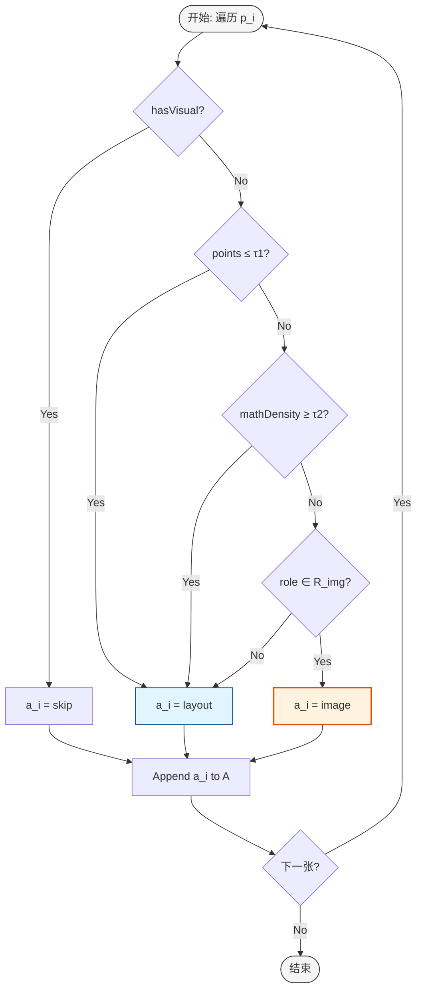

```mermaid
graph TD
    %% 定义节点
    Start([开始: 遍历 p_i]) --> Judge1{hasVisual?}
    
    %% 决策主干 (垂直向下)
    Judge1 -- "No"  --> Judge2{"points ≤ τ1?"}
    Judge2 -- "No"  --> Judge3{"mathDensity ≥ τ2?"}
    Judge3 -- "No"  --> Judge4{"role ∈ R_img?"}
    
    %% 执行分支 (向右平移)
    Judge1 -- "Yes" --> ActSkip[a_i = skip]
    Judge2 -- "Yes" --> ActLayout
    Judge3 -- "Yes" --> ActLayout
    Judge4 -- "Yes" --> ActImage[a_i = image]
    Judge4 -- "No"  --> ActLayout[a_i = layout]

    %% 汇总回流
    ActSkip   --> Append[Append a_i to A]
    ActLayout --> Append
    ActImage  --> Append
    
    Append --> Next{下一张?}
    Next -- "Yes" --> Start
    Next -- "No"  --> End([结束])

    %% 样式精简
    style Start fill:#f5f5f5,stroke:#333
    style End   fill:#f5f5f5,stroke:#333
    style ActImage fill:#fff3e0,stroke:#e65100,stroke-width:2px
    style ActLayout fill:#e1f5fe,stroke:#01579b
```